title: Forum Manual
nav_order: 2
description: "Forum Manual"

# Forum Manual

{: .no_toc }

## Table of contents

{: .no_toc .text-delta }

1. TOC

# General Information

## Forum Purpose

The purpose of this web application is to make information readily available and facilitate communication in the larger strata community.  It does this by providing a place for conversations, a calendar of events, a business directory and a library with documents and web sites.  The Forum is meant for hands on practical day to day issues a council or property manager might face.  These may include questions about a particular service provider, references for a good landscaper, the best lawyer etc.  If you have questions concerning bylaws, the act, the Tribunal and other such concerns, please contact the Vancouver Island Strata Owner's Association, the Condominium Home Owner's Association or a strata lawyer.

## Basic Conventions

**Bolded** paragraph text represents titles, boxes or buttons in the software.  Paragraph text in *italics* is for emphasis.

## Browsers

After testing most available browsers, all work well including Firefox, Chrome, Explorer, Edge and Safari.  Users should know that all browsers have settings that control how files are displayed on their screen and or downloaded on their machine.  StrataCommons does not control these settings.

## Software Responsive to Design

The software is "responsive to design" and its appearance will change depending on the size of the browser display on your web application.  These help files assume you are using a full (or 2/3 full) screen web browser program (Explorer, Chrome etc.) on your desktop or laptop computer.  Those using a hand held device will need to click on the "hamburger" icon on the right to show menus.

## First Time Log in

You may sign on at https://stratacommons.ca/forum/sign_up.  To protect your privacy, the web application will ask you to set your password on this screen.  Please check off the boxes giving StrataCommons Forum the right to send you email and indicating you accept the agreements for use. You will also be asked to indicate your primary geographic area of interest.

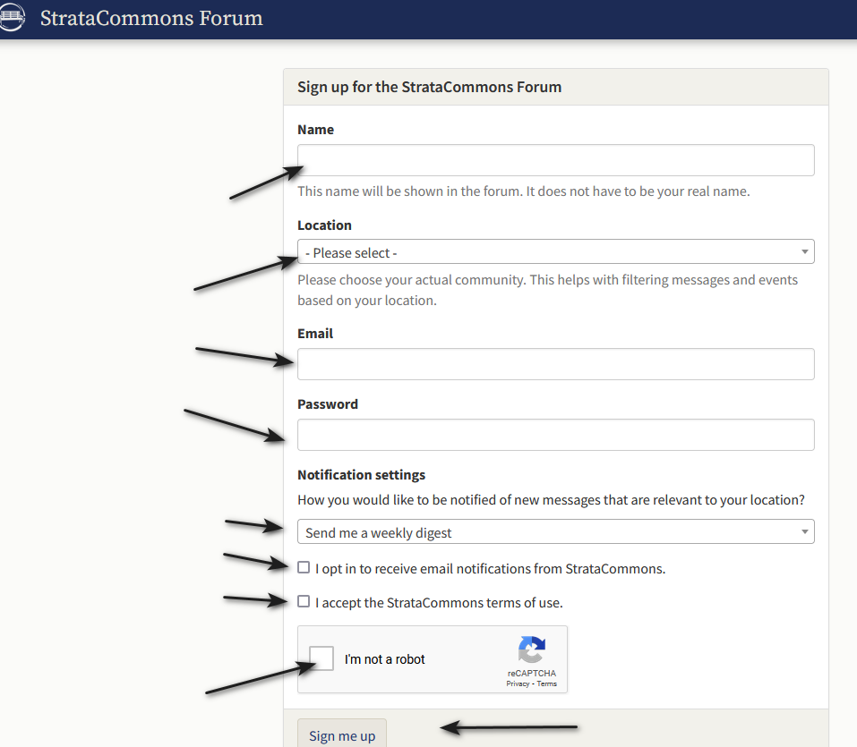

### Note

Once you've logged on, you may return to the Forum by typing in https://stratacommons.ca/forum/messages in your web browser and press enter.  The site will remember you and you will not have to re-enter your credentials when you return.  We suggest you create a book mark in your browser.  You can also type in www.stratacommons.ca and you will go to our web site and click on Forum.

### Forgetting a Password

If a you forget your password, there is a reset password feature in the software.  After you click on **Sign in** on the StrataCommons Forum web page, click on **Forgot password?** under the **Log in** button.  A **Reset your password** box opens asking you to enter the email you use for StrataCommons Forum (most likely your home email.)  After you have entered your email address, click on "Send me the email."  StrataCommons will send an email to your email account with a link that you should click on.  This will take you to a StrataCommons page asking you to enter a new password.  The link has a time limit.

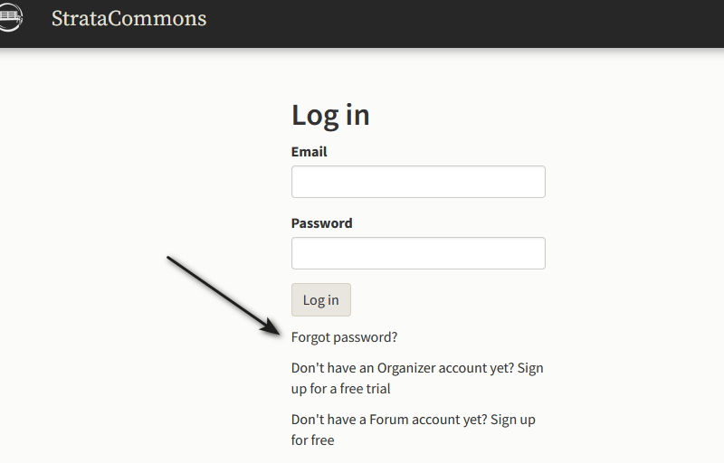

### Logging Off

You may simply close your browser window and then if you return to the website within a couple of days, you will be logged back in automatically. If you want to permanently log off the site, click on your user name in the right hand top corner and select the option to **Log out**.  If you return to the site you will have to re-enter your credentials.

## The Conversation Service

The first screen that appears when you enter the web application is the main conversation service. The service defaults to your chosen geographic area of interest showing posts with the most recent at the top.  

The conversation area serves as a way to organize StrataCommons Forum related communications in one place.

The main conversation screen is divided into two parts.  On the left under the title of **Conversation** are all of the communications available for your review.

On the right hand side of the screen you will see a button to create a new conversation and underneath that a heading called Filter conversations which allows you to control what you see in the left column.

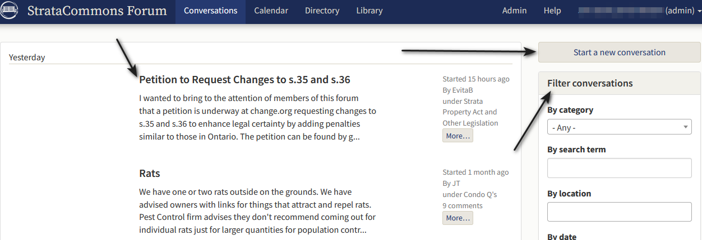

### Starting a Conversation

Clicking on the **Start a new conversation** button found on the top right hand side of the screen, will open the new conversation box.  Once the new mail screen opens, there is a **Cancel** button on the right hand top if you change your mind.

The new conversation box contains several choices.

#### Title

Fill in a title for your message by clicking on this box.  This is similar to the *re:* used in most written communication.

#### Category

Click your mouse in the box under **Category** and a list of all of the strata topics available to you will appear.  Choose one as close to your topic as possible.  If you need more topics, send your system administrator a suggestion.  This helps those searching the posts to narrow down what might be of interest.

#### Message.

Fill in your text and the box will expand as needed.  You may format your conversation using *mark down* language which you may learn about by clicking on the **Formatting help** letters at the bottom right of the box but this is optional.

#### Location

Clicking the box that says **location** allows you to choose how far your conversation should be distributed.  So for example, if you want to know about good landscape gardeners in your immediate area choose your local town or regional district.  If the area is province wide choose British Columbia.

#### Related Documents.

You may attach a file to your conversation by placing your cursor in the **related documents** box. By default, the most recent documents loaded in the **Library** appear in date order.  As well, if the file is already in the Forum library, you may find the file by typing the first few letters of the name, group or category until the right file shows up.  As you type, the most recent files on the website will appear to a maximum of 10 that match your search criteria.  

You may also upload a new file if you wish by clicking on **upload a new document**.  This screen has a number of options for your use which include:

#### Upload a File

Clicking on **Choose File** will open a file manager showing your computer filing system.  Navigate through your file manager to find the document you wish to upload.  

#### Note

You may only load PDF files to ensure others can read the material in their web browser.  Most browsers have a built in PDF viewer that will work well.  Word processor files can not be read on the screen.

#### Description

Click in the **Description** box and enter a one or two sentence detailed description of the document to help other users know if this is the document that will be of most assistance to them.

At the bottom of these choices, there is an **upload new document ** button.  Click on this and StrataCommons Forum will upload your document and take you back to the **Post conversation** screen with the document loaded in the **Related documents** box.  

#### Note

Uploading a new document will also add this document to the Library service as well.

#### Post message.

Finally, click on this button to post your conversation or comments.  

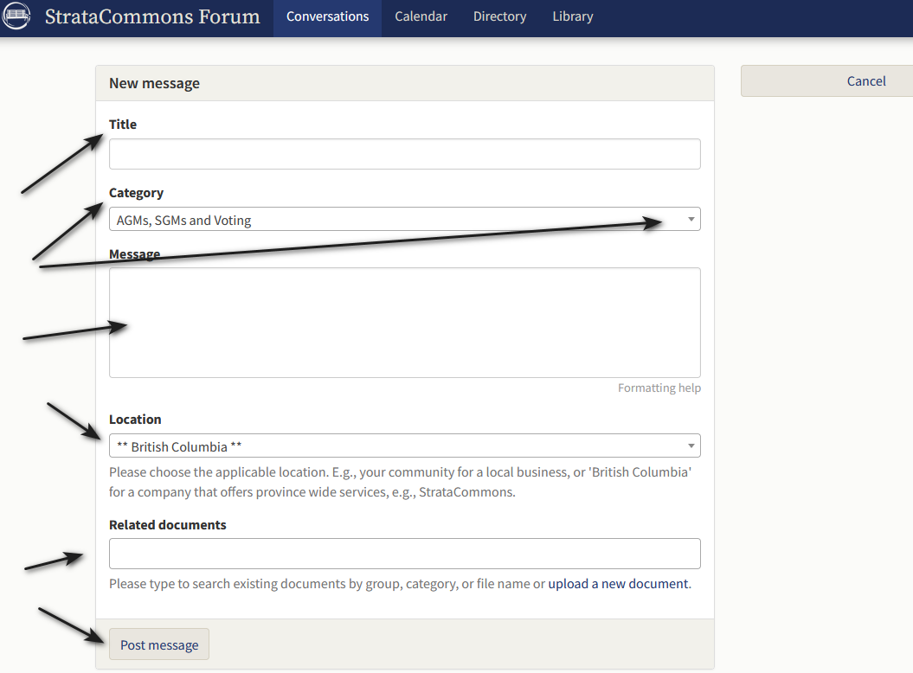

### Adding Comments

You may participate in a conversation by clicking on the box "**more...** listed under the message." A new screen opens showing you the original posting and a text box allowing you to type in your comment and post it.  Other comments are posted beneath the comment box.

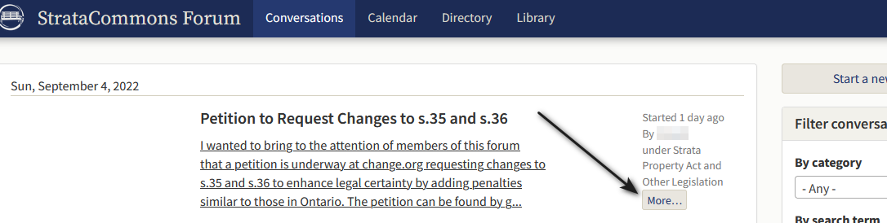

### Inappropriate Conversation or Comment

Once you've clicked on the **More** box and opened the conversation, you'll see that every conversation and comment includes the option of clicking on a box with **Flag** and a flag icon located beneath the conversation or comment.  The screen will change and a notice appears **We flagged the message and will review it.**  The system will alert the moderator(s) who will review the comment according to the **Rules of the Road** document.  If they agree the comment is inappropriate, the comment will be removed and a note posted that this has happened.  If an individual persists in posting inappropriate comments, their account may be cancelled.

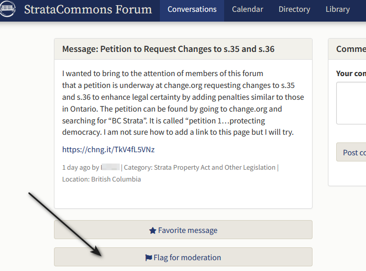

### Filtering Conversations

StrataCommons Forum uses a similar search function in all its services found on the right hand side beside the list of conversations, calendar events, documents or web links.  This area allows you to enter search parameters.

**By category:**  Clicking on the drop box gives you a list of available categories.  The default is **Any** or you may choose one that specifically interests you such as **Building Supplies**.

**By search term:**  You may enter a search term in the **By search term** box by typing the letters of the word you're looking for. The search box will search as you type and show conversations that contain this word.  If you delete the word, all conversations will reappear.

**By location:**  You may select conversations directed to a specific geographic area by clicking on **By location** box.  This will open a list of all regional areas and cities in the Province - choose one and you will see conversations posted for that region.  

**By date:**  You may select conversations **By date** as well.  Clicking in the box **Posted after** will let you choose either **Posted after** or **Posted before**.  Then click on the box to the right and a calendar will appear showing today's date.  You may choose any date that suits and click on **use this date** to filter conversations before or after your choice.

**Reset filters:**  Finally at the bottom right there is a box titled "Reset Filters" for you to return to the defaults.

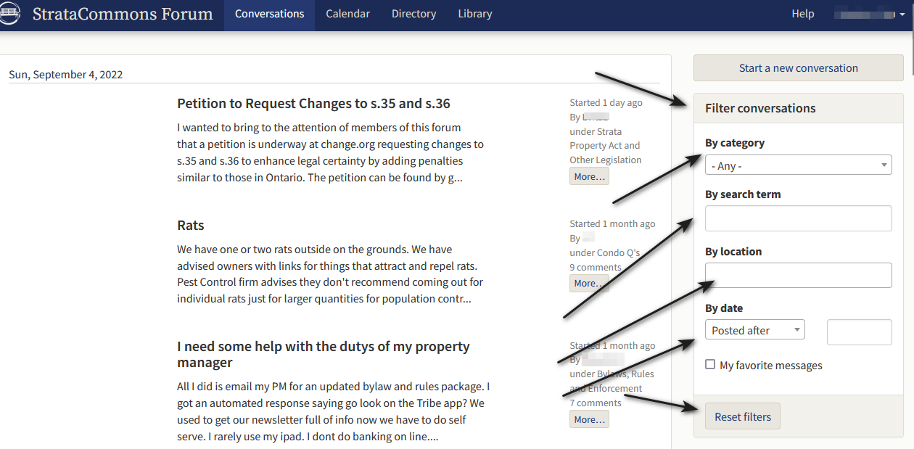

## Calendar Service

The **Calendar Service** is the second service found on the top bar of the web site  assuming your computer’s browser is mostly full screen.  If you’re using a tablet or your browser is partial screen, click on the three lines on the far right of the top bar to expand the main menu.)  When you click on this, a list of calendar events appears showing the events in date order.  

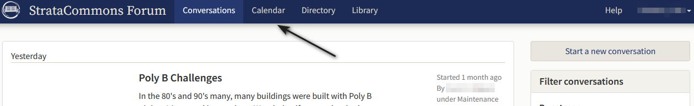

### Creating a New Event

In any view, you may select the **New event** button on the top right hand side and a **New event** box will open. The **New event** box contains several choices including a **Cancel** button on the right hand top.

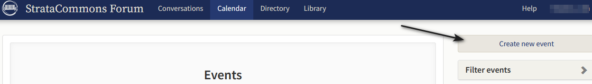

#### Event name

Type in a descriptive name for the event.

#### Event date and time

Clicking on this box will open a box that shows a calendar on the left and a digital clock on the right.  You may choose a start date for the event and then a time by hours and 15 minute intervals.  You should choose **Am** or **PM** and then click **Use this date** to continue.

#### Location

Select the provincial region for the meeting location.

#### Location details

Enter the specific address or directions for the event.

#### Description

By clicking in the **Description** text box, you may add an explanation related to the meeting.

#### Create event

Finally click on the **Create event** box at the bottom to create your new calendar entry.  A new box will open allowing you to post a note to the conversation board letting everyone know that a new event has been added to the calendar.  

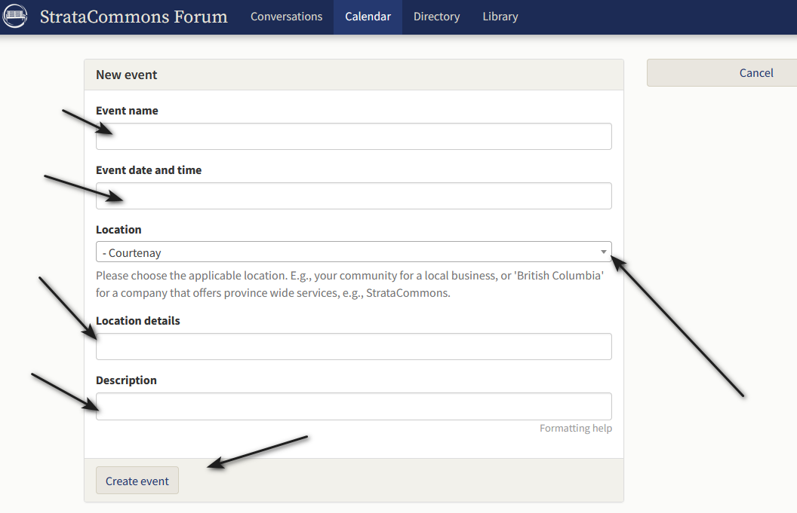

### Filtering Calendar Events

StrataCommons Forum uses a similar search function in all its services found on the right hand side beside the list of conversations, calendar events, documents or web links.  This area allows you to enter search parameters.   Please click on the following link to see the filter help.

[Filter details](#Filters)

## The Directory Service

This service is found on the top right of the menu bar in normal screen mode between the conversations Service and the Library.  Clicking on the bar opens up a new screen that by defaults shows a list of strata related businesses and their contact information.  Please contact the Web Manager to have your business listed.  

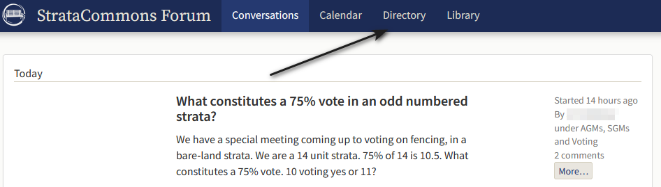

The Directory:

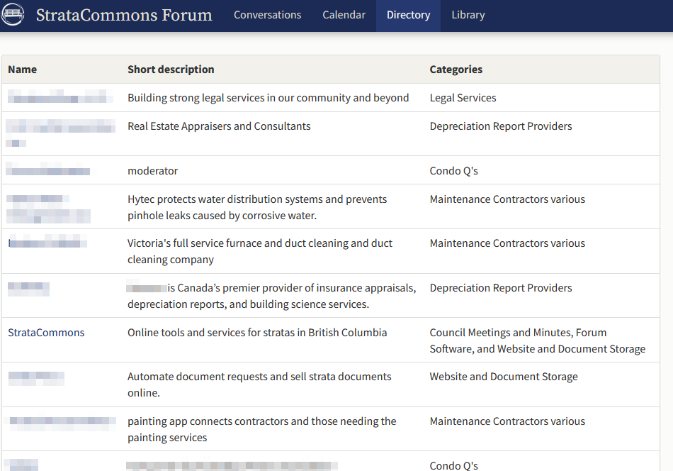

### Filtering the Directory

StrataCommons Forum uses a similar search function in all its services found on the right hand side beside the list of conversations, calendar events, documents or web links.  This area allows you to enter search parameters.   Please click on the following link to see the filter help.

[Filter details](#Filters)

## The Library Service

The **Library** Service is found on the main menu bar across the top next to the Directory Service.  (This assumes your computer’s browser is mostly full screen.  If you’re using a tablet or your browser is partial screen, click on the three lines on the far right of the top bar to expand the main menu.)  Clicking on this opens the **Documents** screen by default.  You will see another header called **Web links** beside **Documents** which when clicked will show the **Web Link** service.  These two services provide a resource to store and retrieve important documents and web sites. 

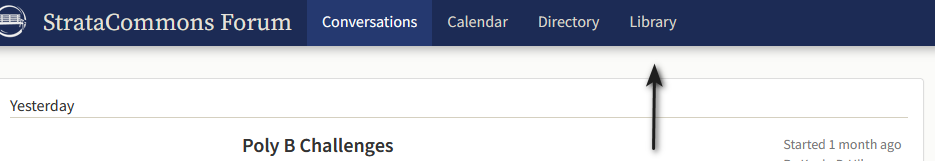

The default document screen has a large box on the left showing documents listed in date order with their name, group, category and date of creation.  There is a button to **Create new document** on the right at the top and the **Filter documents** service which provides a detailed search function.

The **Web links** screen has a similar layout.

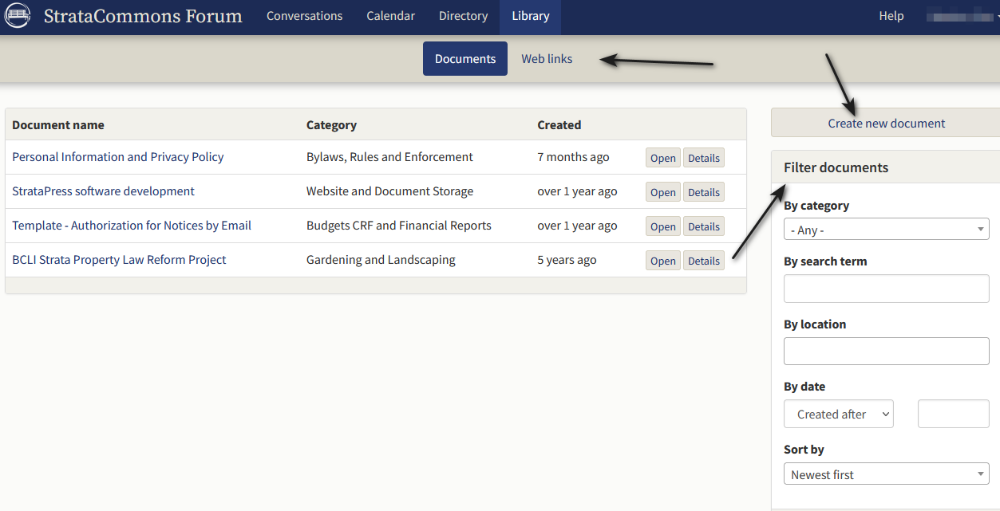

### Reading a Document

In the default document screen, you will see document names highlighted in the left hand column.  

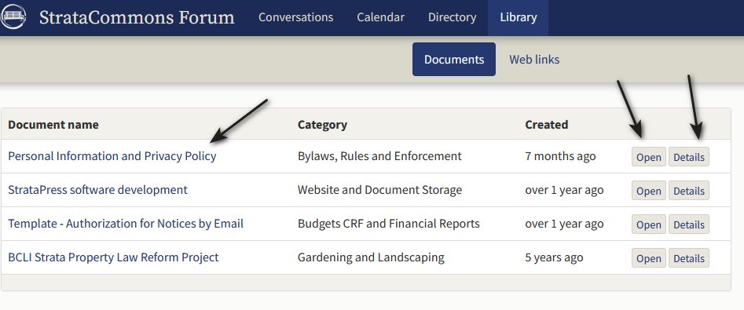

Click on the document name and a screen will open showing more detailed information related to the document including a full description of when it was uploaded, by whom, and the topic or category.  Any comments on the document made by other Forum members are included.  In the middle of the document screen is a button **Open file** which when clicked will open the file in the StrataCommons Forum screen on your web browsers (depending on your settings, your browser may download the document or pop up a notice asking what you'd like to do. )

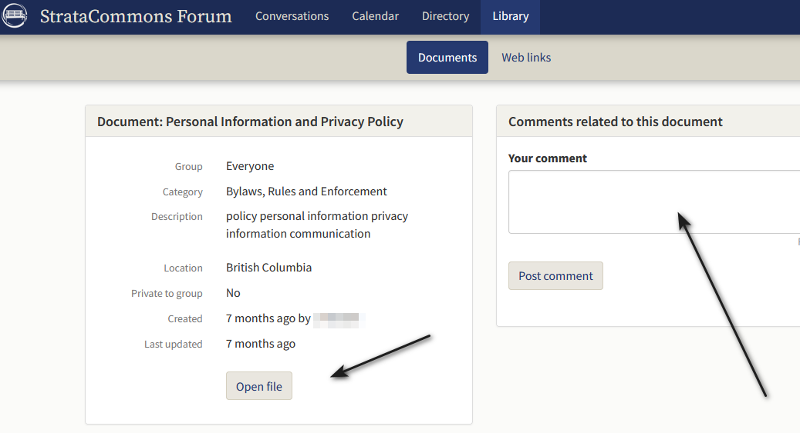

Only files loaded in PDF format are permitted in the Forum.  Most word processors allow the creator to save their documents in this format and it makes online access for all possible.  Many owners may not have the necessary software to read a file created by a new version of Microsoft Word for example.

Click on your browser's back button to take you back to the specific document screen in the StrataCommons Forum Library and then clicking on **Library** takes you back to the default screen showing all documents.

### Adding a Document

In the **Documents** screen there is a **Create new document** button on the right hand side at the top above the **Select document category** heading.  Clicking on this will open a screen to add a document.  The **New document** screen has a number of options for your use.

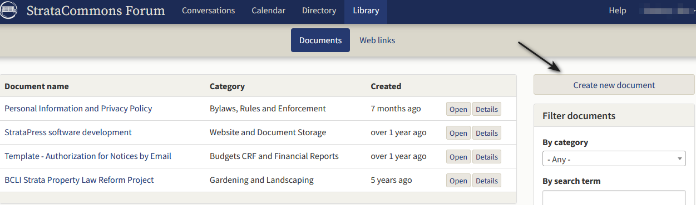

#### Upload a file from your computer

Clicking on **Choose File** will open a file manager showing your computer filing system.  Navigate through your file manager to find the document you wish to upload.

#### Category

Clicking on the **- Please choose -** button will open a list of available topics to help with file retrieval.  Please select one.

**Note** The Forum will work with users to sort out a number of additional categories to help strata members file their documents so this will change over time.

#### Description

Click in the **Description** box and enter a one or two sentence detailed description of the document to help other users know if this is the document that will be of most assistance to them.

#### Location

Select the provincial region that describes the document's relevance.  Use the default **British Columbia** if everyone would be interested.

#### Override Creation Date

Articles are listed by the date they are uploaded to the library with the most recent at the top of the list.  If for some reason, you wish to change this, you may enter a new creation date.  This is most often used when you have an historical document and you want the date in the library to match the date of the document's origin not the date it was uploaded.  

#### Cancel

There is a **Cancel** button on the top right side of the screen to stop the document creation process.

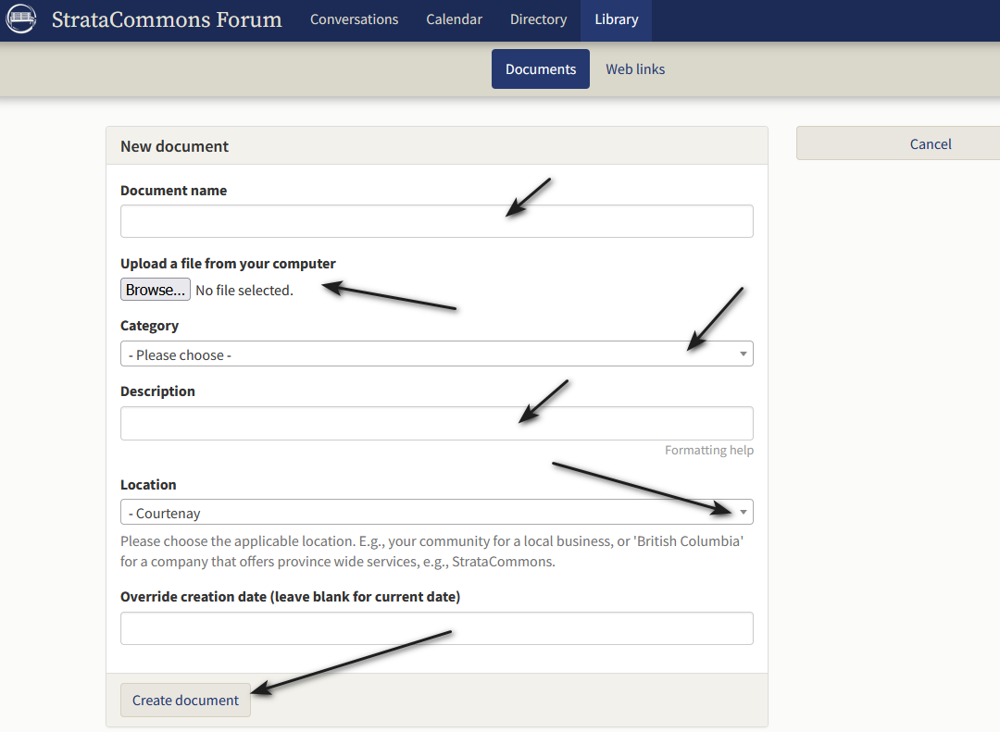

### Filtering Documents

StrataCommons Forum uses a similar search function in all its services found on the right hand side beside the list of conversations, calendar events, documents or web links.  This area allows you to enter search parameters.   Please click on the following link to see the filter help.

[Filter details](#Filters)

## Using Web Links

Clicking on the **Web links** button at the top of the **Library** screen will open the web links service. 

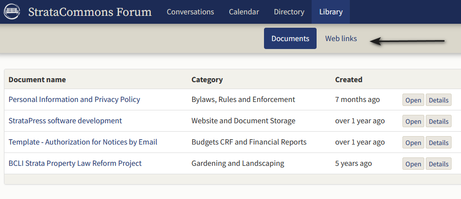

You will see a list of the available web link names on the left with a Web Address beside them.   Clicking on the web address will take you directly from StrataCommons Forum to that web site.  Clicking on the web link name will give you further details on the link to help you decide if the link is the best one for you to use. 

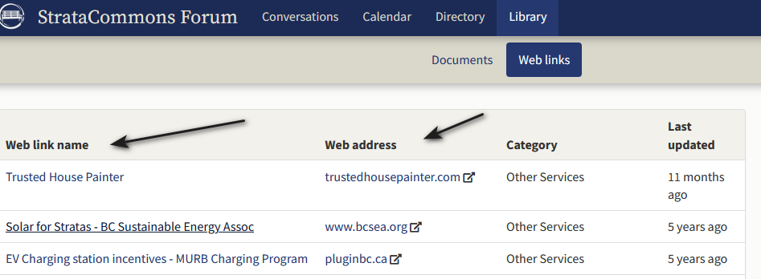

### Adding a Web Link

On the top of your application on the right hand side there is a **Create new web link** button that will open a screen allowing you to create a new web link.  

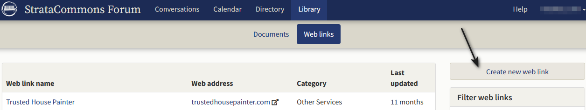

#### Web link name

Choose a descriptive name for the web link.  Click on the box and type in something that will help others understand what the link will do for them.

#### Web link address

Click on this box and type in the full web address for the site from your browser usually in the form of www.website.ca  or https://website.ca.

#### Category

Clicking on the **- Please choose -** button will open a list of available categories to help with file retrieval.  Please select one.

#### Description

Click in the **Description** box and enter a one or two sentence detailed description of the document to help other users know if this is the document that will be of most assistance to them.

### Location

Select the provincial region that describes the document's relevance.  Use the default **British Columbia** if everyone would be interested.

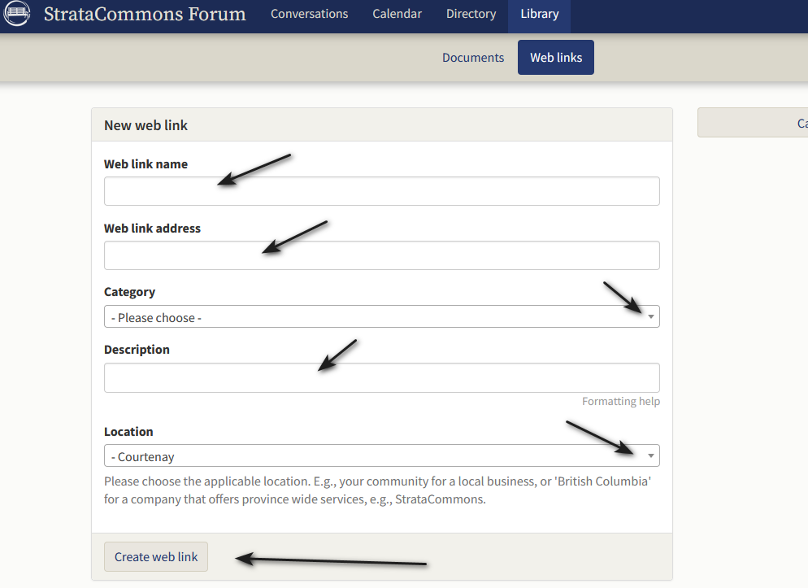

### Filtering Links

StrataCommons Forum uses a similar search function in all its services found on the right hand side beside the list of conversations, calendar events, documents or web links.  This area allows you to enter search parameters.   Please click on the following link to see the filter help.

[Filter details](#Filters)

## Changing Personal Information

StrataCommons Forum allows Forum users to update their personal information.  Clicking on the hamburger icon and then clicking on your user name at the bottom of the menu or if you are in desktop mode click on your user name on the far right.  This will drop down three choices: **Your Profile**, **Log out** and **Organizer** (if your strata is using our management software.)

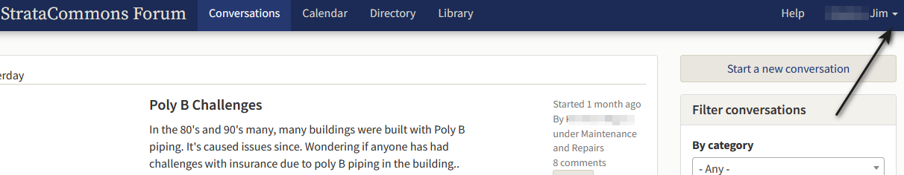

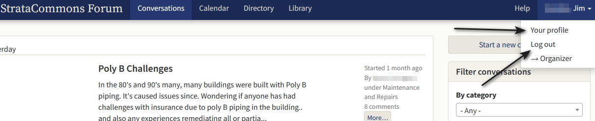

### Your Profile

Clicking on your profile will open a screen that shows a series of boxes allowing you  to change your **Name**, preferred **Location**, **Email** address and your **Password** if you wish. Click on any of these and enter the new information.  You may also remove your information from the Forum by clicking on **Cancel my account.**  You also can set the frequency of summary reports mailed to your address.  Finally, click on **Update user** and the system will make these changes.

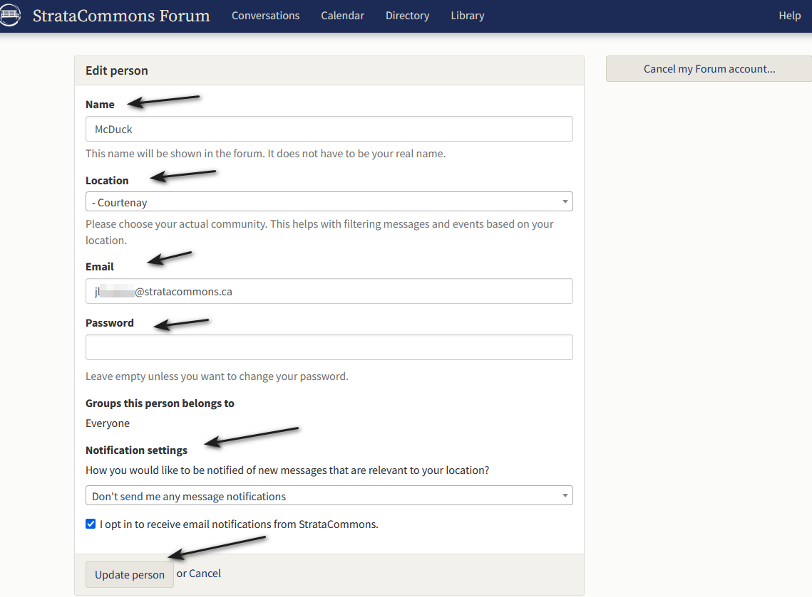

### Logging Out

Choosing this option will take you out of the forum site.  You will have to re-enter your user name and password if you return to the site at a later time.

