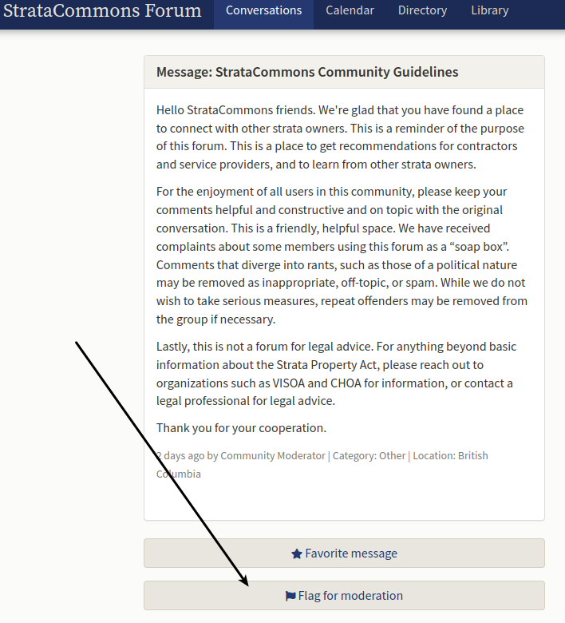

# StrataCommons Forum - Rules of the Road
{: .no_toc }

## Table of contents
{: .no_toc .text-delta }

1. TOC
{:toc}

## This is a Civilized Place for Public Discussion

Please treat StrataCommons Forum with the same respect you would a public park. We, too, are a shared community resource — a place to share skills, knowledge and interests through ongoing conversation.

These are not hard and fast rules, merely aids to the human judgment of the StrataCommons Forum community. Use these guidelines to keep this a clean, well-lighted place for civilized public discourse.

## Improve the Discussion

Help us make this a great place for discussion by always working to improve the discussion in some way, however small. If you are not sure your post adds to the conversation, think over what you want to say and try again later.

The topics discussed here matter to us and we want you to act as if they matter to you, too. Be respectful of the topics and the people discussing them, even if you disagree with some of what is being said.

One way to improve the discussion is by discovering ones that are already happening. Please spend some time browsing the topics here before replying or starting your own, and you’ll have a better chance of meeting others who share your interests.

## Be Agreeable, Even When You Disagree

You may wish to respond to something by disagreeing with it. That’s fine. But, remember to criticize ideas, not people. Please avoid:

- Name calling. 
- Ad hominem attacks. 
- Responding to a post’s tone instead of its actual content. 
- Knee-jerk contradiction.

Instead, provide reasoned counter-arguments that improve the conversation.

## Your Participation Counts

The conversations we have here set the tone for everyone. Help us influence the future of this community by choosing to engage in discussions that make StrataCommons Forum an interesting place to be — and avoiding those that do not.

Discourse provides tools that enable the community to collectively identify the best (and worst) contributions: favourites, bookmarks, likes, flags, replies, edits, and so forth. Use these tools to improve your own experience, and everyone elses, too.

Let’s try to leave our park better than we found it.

## If You See a Problem, Flag It

Moderators have special authority; they are responsible for this forum. But so are you. With your help, moderators can be community facilitators, not just janitors or police.

When you see bad behaviour, don’t reply. It encourages the bad behaviour by acknowledging it, consumes your energy, and wastes everyone’s time. Every comment has a flag box that you can click on to indicate you think the comment is inappropriate. If enough flags accrue, action will be taken, either automatically or by moderator intervention.

In order to maintain our community, the moderator reserves the right to remove any content and any user account for any reason at any time. Action may include a warning to the author, replacing the comment with a note that the comment has been removed as inappropriate or cancellation of the individual's account. The moderator does not preview new posts in any way; the moderator and site operators take no responsibility for any content posted by the community. The decision of the moderator is final.

## Always Be Civil

Nothing sabotages a healthy conversation like rudeness:

- Be civil. Don’t post anything that a reasonable person would consider offensive, abusive, or hate speech. 
- Keep it clean. Don’t post anything obscene or sexually explicit. 
- Respect each other. Don’t harass anyone, impersonate people, or expose their private information. 
- Respect our forum. Don’t post spam or otherwise vandalize the forum.

These are not concrete terms with precise definitions — avoid even the appearance of any of these things. If you’re unsure, ask yourself how you would feel if your post was featured on the front page of the New York Times.

This is a public forum, and search engines index these discussions. Keep the language, links, and images safe for family and friends.

## Keep It Tidy

Make the effort to put things in the right place, so that we can spend more time discussing and less cleaning up. So:

- Don’t start a topic in the wrong category. 
- Don’t cross-post the same thing in multiple topics. 
- Don’t post no-content replies. 
- Don’t divert a topic by changing it midstream. 
- Don’t sign your posts — every post has your profile information attached to it.

## Post Only Your Own Stuff

You may not post anything digital that belongs to someone else without permission. You may not post descriptions of, links to, or methods for stealing someone’s intellectual property (software, video, audio, images), or for breaking any other law.

## Terms of Service

Yes, legalese is boring, but we must protect ourselves – and by extension, you and your data – against unfriendly folks. We have a Terms of Service (TOS) describing your (and our) behaviour and rights related to content, privacy, and laws. To use this service, you must agree to abide by our TOS please see:  https://stratacommons.ca/forum/terms_of_service
