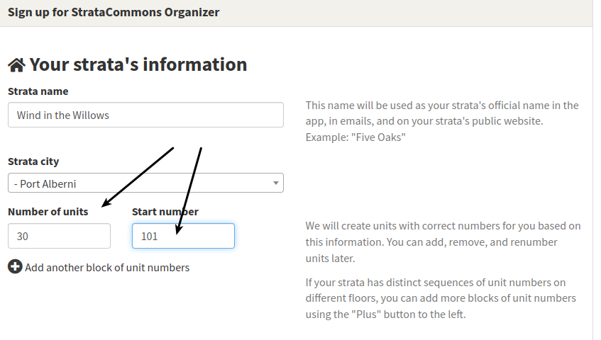
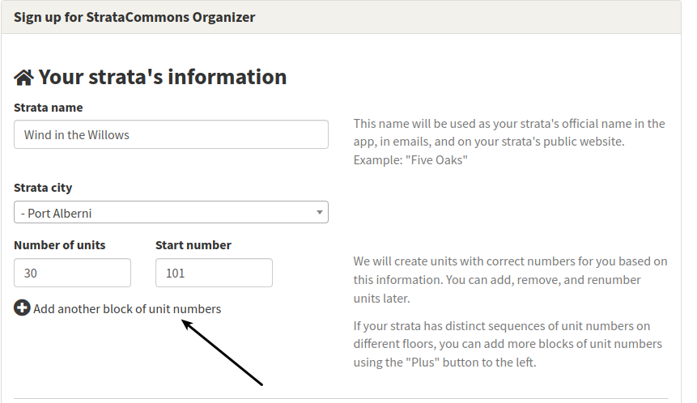
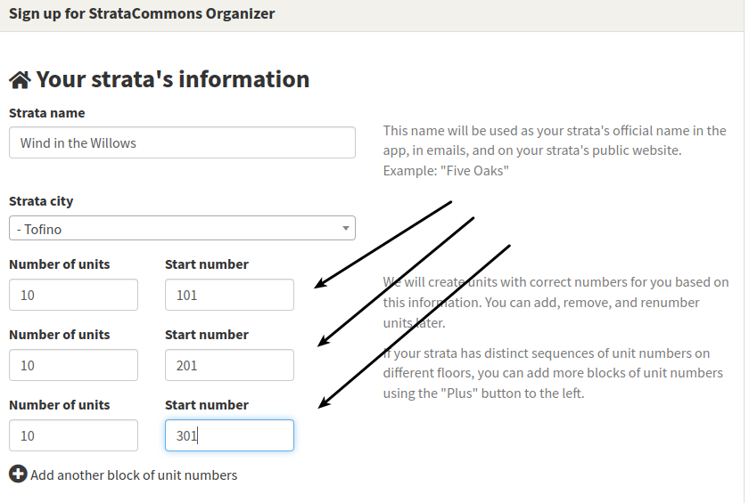

# Floor by floor unit numbering

*How do I enter unit numbers for a strata that has a non linear numbering system?  For example, we have 30 units and the numbers are floor based so level one has units 101 to 110, level two has 201 to 210 and so on.*

On the initial strata sign up screen,  there is a section that lets you set the start and end unit numbers for your whole strata.  (Floor numbering can only be done at the strata sign up screen.)

If you enter your total number of units (30 in this example), and a start number (101) the system will number the units as 101, 102, 103 ... to 130.

In this example, you want to set up a floor by floor numbering system.  Click on the "Add another block of unit numbers" and create a block for each floor.  

Your screen will now show three blocks and you can add the number of units and start number for each floor as follows:

At this point, you can continue with creating your new strata, filling out the required information.  Your strata will have a floor by floor numbering system. 
