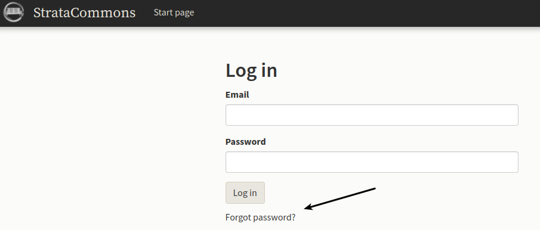

# Setting Passwords.

*I have a user who has forgotten their password and has asked me to tell them what it is.  How do I do this?*

Unfortunately your admin super powers are limited and you can't see account passwords.  You can see their account information and delete and reset their password for them if you wish.  The best option is to ask your owner to create a new one. Have them go to our sign on page at the following link:

https://stratacommons.ca/log_in

Click on "Forgot password?" and the system will send them an email with directions and a link to create a new one.

