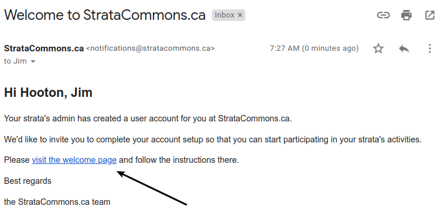
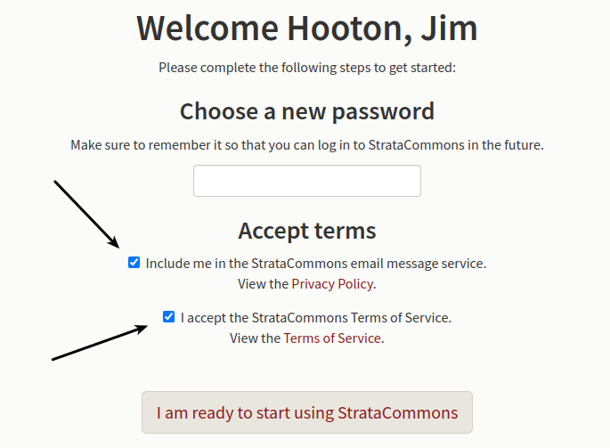

# Helping owners connect with the Organizer

*One of our owners can't access StrataCommons on their computer (phone, laptop, tab etc.)  What's wrong?*

In every case to date, we've discovered that users with access difficulties involves the terms of service.   Once your admin has set a user up on the Organizer, the system will send that user a welcome email.  

When the user clicks on the link, they go to our sign on page but must complete the process.  So far, 100% of users with sign on problems haven't done this.

 We suggest you resend the welcome email to that individual.  Once they've accepted the terms and created a password (basically completed the sign on process) they should not have any problems.
