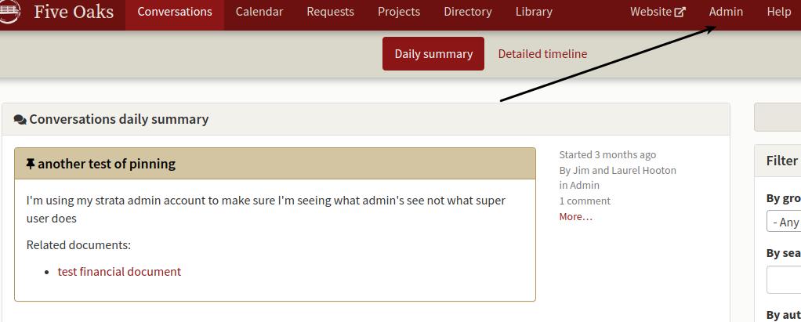
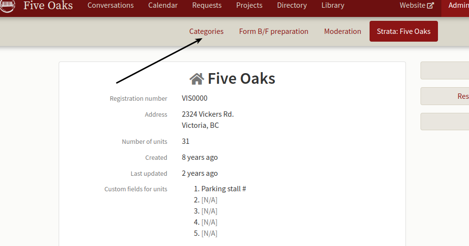
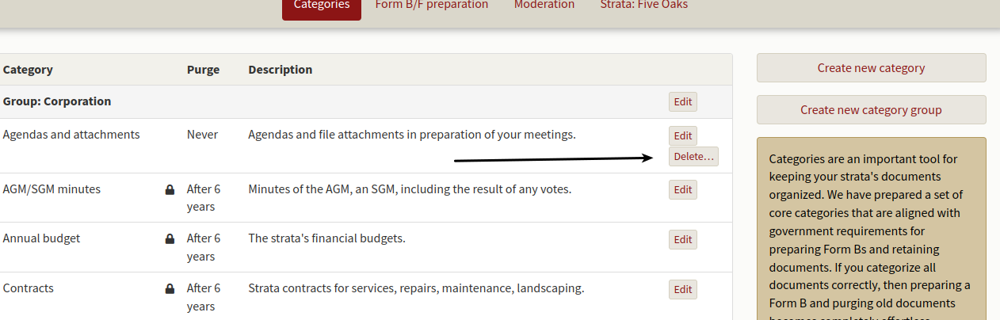
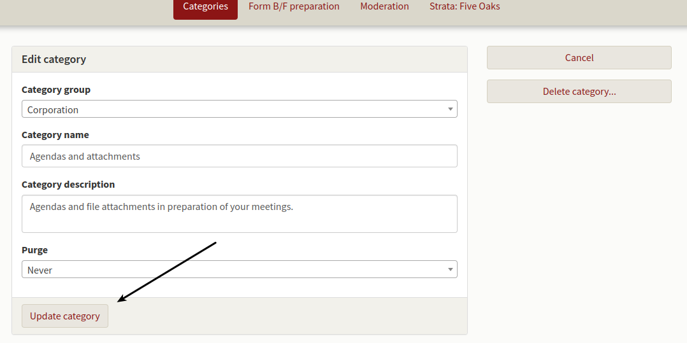
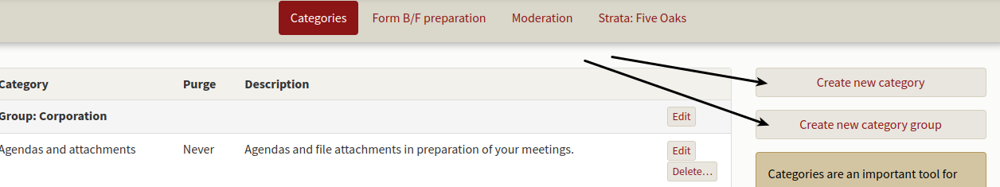
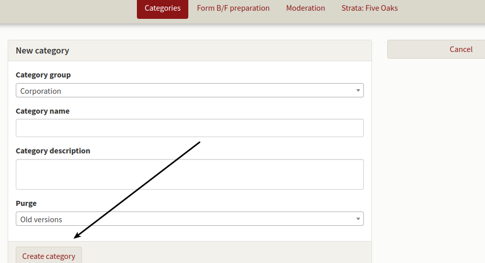
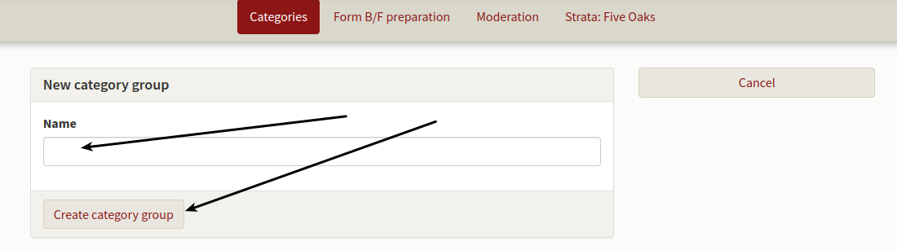

How to edit or add categories.

We have a different filing system and don't want to use the Organizer's categories.  Can we change these?

The Organizer comes with a set of standard categories that most stratas find useful.  Our service provides a Form B and Form F document management system and standard categories are used in this process.  As a result *Form B and F related categories can't be edited or deleted.*

To edit categories, choose the **Admin** function from the main toolbar.

The admin screen will open and you may choose **Categories** from the secondary menu.

The Category edit screen will open showing all of the categories in your strata.  You'll see a **Delete** option next to those that are optional and may be edited  Clicking on delete will remove the category but not any of your documents.

Clicking on the **Edit** button opens the edit screen allowing you to change details related to the category.  Only categories that can be deleted may be edited.  When you've completed your changes, *be sure to click on the* **Update category button**.

You may also click on **Create new category or Create new category group** on the far right. 

Clicking on **Create new category** opens the editing screen allowing you to add categories to your strata.

Clicking on **Create new category group** sets up a header for a drop down box you may use to organize your categories.  So for example, you might want a category header that says Finance and then have all financial related categories listed under it as a drop down menu.  Only categories that can be deleted may be moved to a different group.  Form B and F categories are under the header Corporation.  You may edit all category groups.

