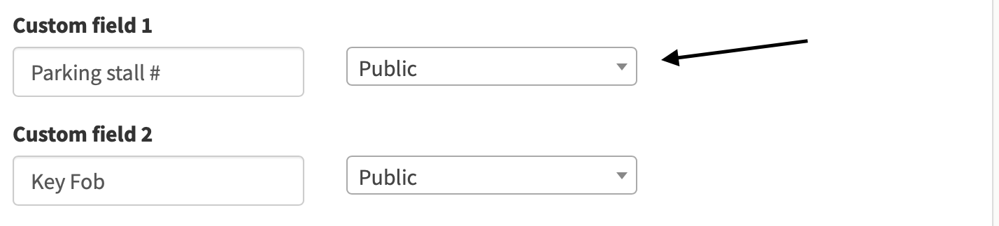
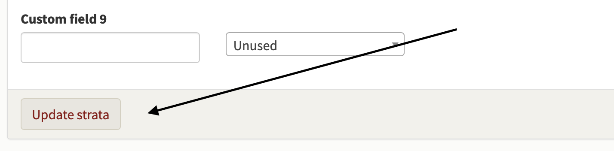

# How to add custom information to your directory.

*Our strata wants to track key fobs and parking spots for units.  How do we do this?*

After you've logged in you'll find yourself on the **Conversation page.**  On the main menu, click on **Admin**.  

A new window opens and you may click **Edit strata.**  

Your strata details form now opens and if you scroll to the bottom of the form, after **Province,**  you'll see a header called **Custom fields for units.**

As a default, we have entered **Parking stall #** and **Pet** in the next field but you may change this to anything you might want.  Enter the text you wish and then check the box beside it that says **Enabled.**  Checking or un-checking the enabled box makes the field active or disables it.  Once checked, the field shows up on the directory service when you click on units.  

You've got five custom fields that you can set up for parking stalls, key fobs, pets etc.  Once you've set up the fields you want, click on **Update strata** and you return to your strata's main information page under **Admin.**

You may now add your custom data for individual units using the directory service.   
