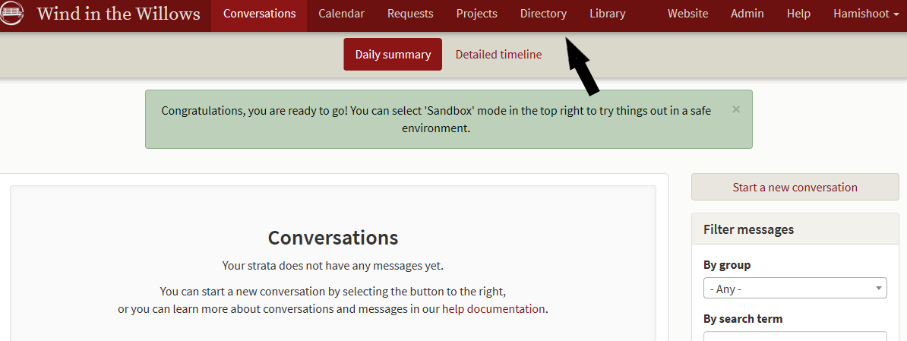
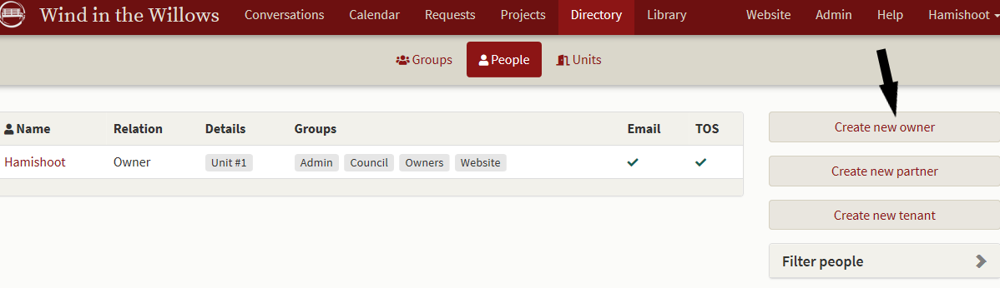
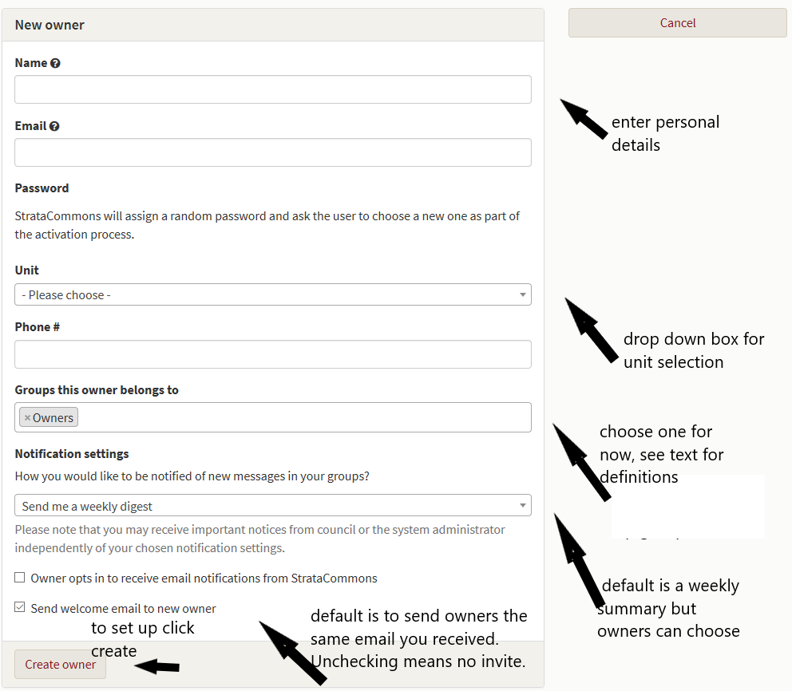
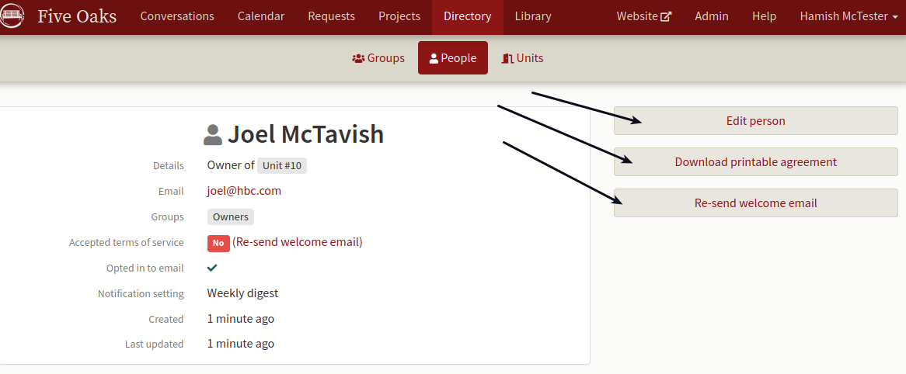
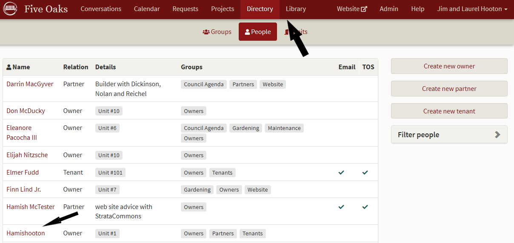
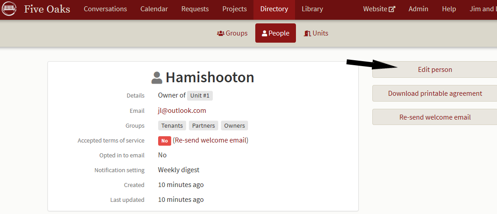
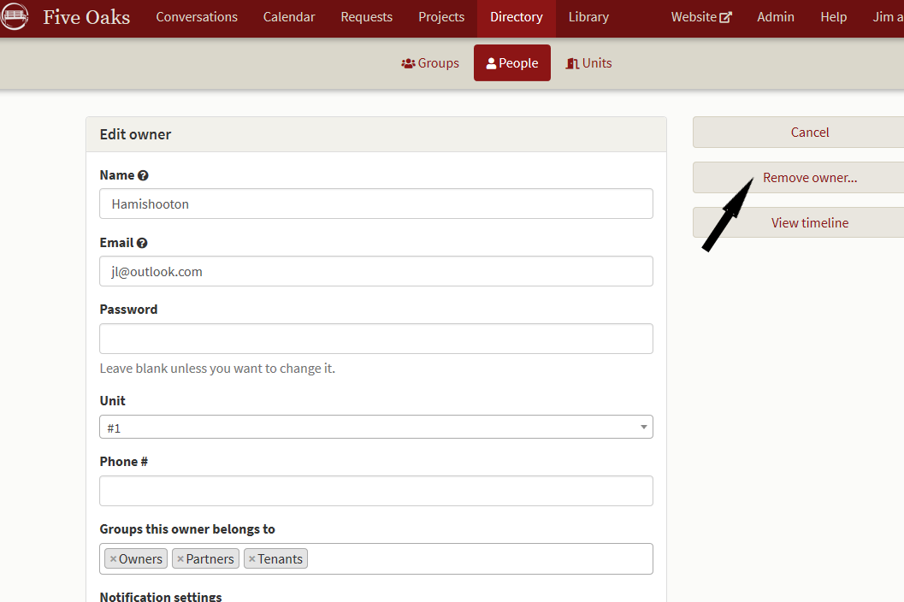

# How to add or remove people in your Strata

*We've are seeing some turnover in our strata.  How do we add or remove people from the directory?*

## Add people

After you've logged in you'll find yourself on the **Conversation page**  On the main menu, click on **Directory**.  

A new screen opens where you will enter your Strata members.  You'll notice that your name as the admin is already on the list.  Choose **Create new owner** and the next screen opens allowing you to enter owner details.  (You may also choose **Create new partner** or **Create new tenant** - the details are the same.)

The following screen will open for you to enter the owner's details.  

The drop down box for **Groups this owner belongs to** gives a number of choices individuals may belong to:

 - admin - this gives full permissions to change everything to the individual.  You are already the "admin" and be careful about appointing others to this group.
 - owner - registered on title owner of the strata lot
 - council - elected to council
 - partner - manager, gardener, handyman etc.
 - tenants - renters 
 - website - editing permission for changing the website.

Since most will be owners, we suggest you use the default to start with. You can change this later and you may assign a new person to as many groups as you wish.  

As well, note that you can select the time frame for a digest of posted conversations and owners can change this themselves.  Some want to read everything posted immediately and some don't.  When you've entered the detail, click on **Create owner** and a summary screen appears.  The same email you received is sent immediately to the newly registered owner inviting them to the welcome page and go through the sign on process.  

Note the options to immediately **Edit person** as well as **Download printable agreement** or **Re-send welcome email.**  

Repeat this process for each owner.  

**NOTE:** StrataCommons offers a service to assist you in setting up your directory especially if you have a large number in your community. There is a charge for this - please contact StrataCommons.

## Remove people

Most of us will experience some turnover in our strata over time.  To remove an owner (or renter, partner etc.) click on the **Directory** in the main menu bar and select the person you wish to remove.  

A new screen will open with that person's details and you may click on **Edit person.**

The screen that opens allows you to delete this individual by clicking on **Remove "owner" or "renter" etc.**

This will remove them from your directory.  All of their conversations, library contributions or documents attached to their unit will remain.  

