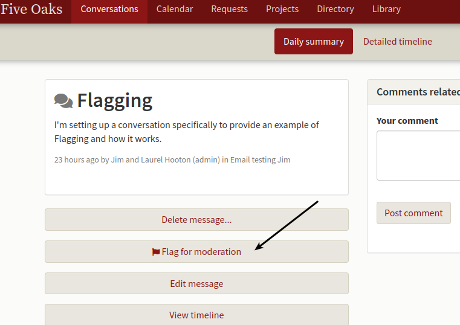
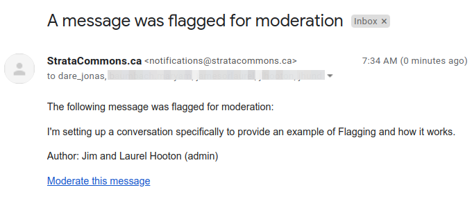
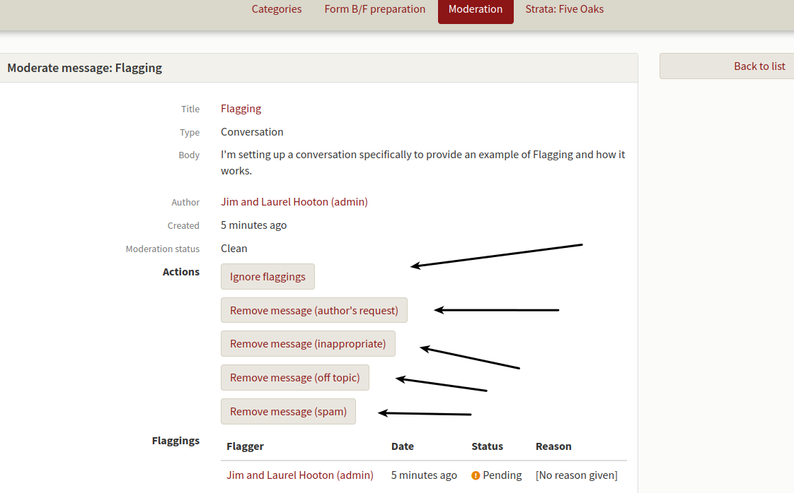
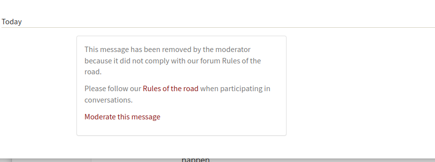
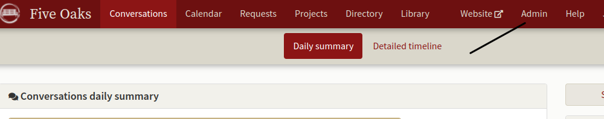
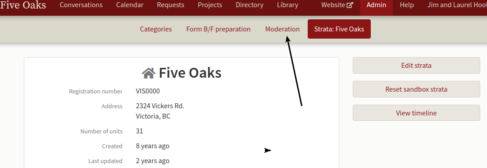
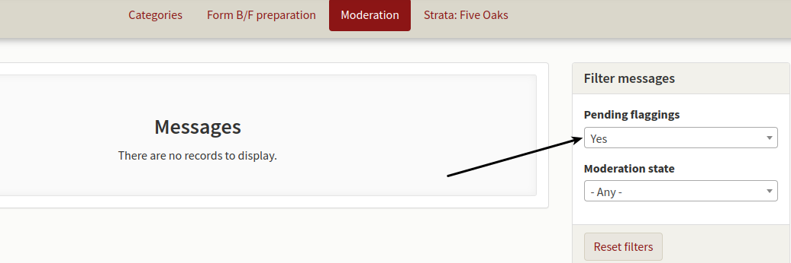
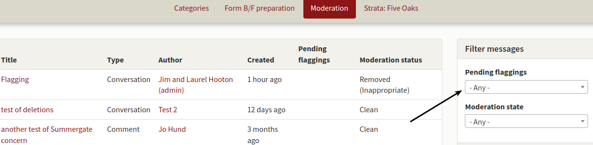
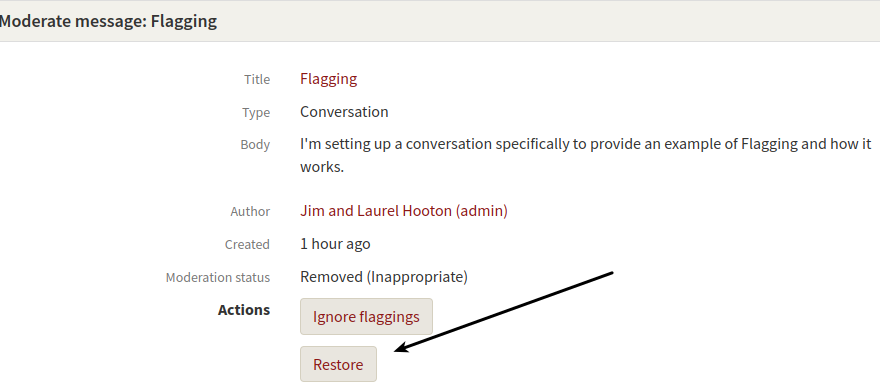

# Flagged conversations.

*One of our owners has flagged a conversation as offensive, what do I do?*

Unfortunately, there will always be some users that want to use the system as a platform for their particular views.  These views may be offensive or inappropriate and you will need to deal with them.  The system allows for any user to "flag" a message and leave a reason.  

Once someone has flagged a message, you'll receive an email that looks like the following from the system:

Click on Moderate this message and the following screen will open:

Please note the actions available to you.  Click on anyone of these and the system will remove the message or comment and replace it with what is in the box - see below for an example.  The message is not deleted but replaced with the action statement unless you choose "Ignore flaggings" in which case nothing will happen.

The system also allows you to restore a flagged message.  Click on the Admin button top right.

In the screen that opens, choose "Moderation".

The moderation module opens and unless there is a current flag to be managed, is likely empty.  

Click on the drop box to the right "Pending flaggings" and choose "Any" and all flaggings will appear.  

Click on the flagged conversation of interest and then on the "Restore" button and the posting will reappear on the conversation board.

