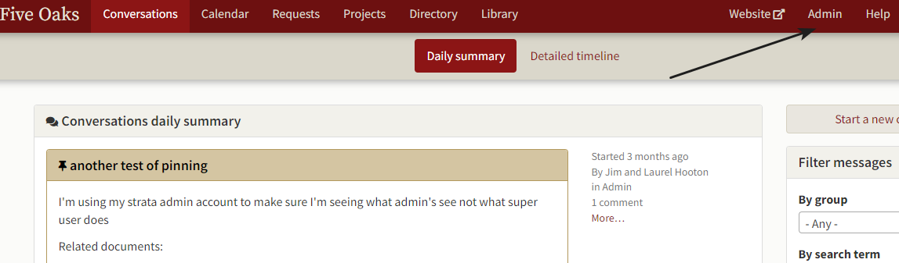
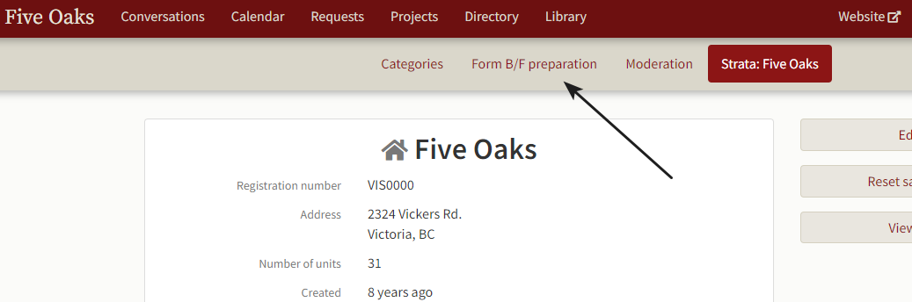
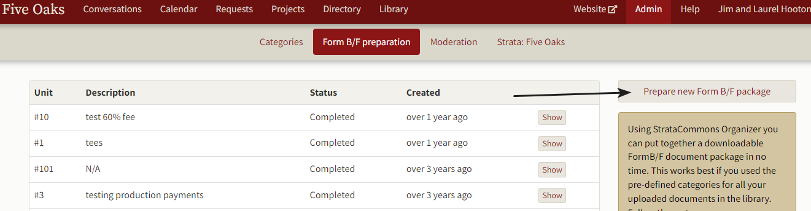
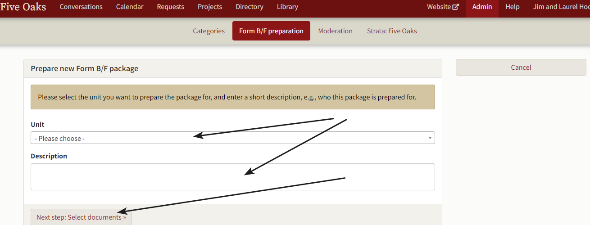
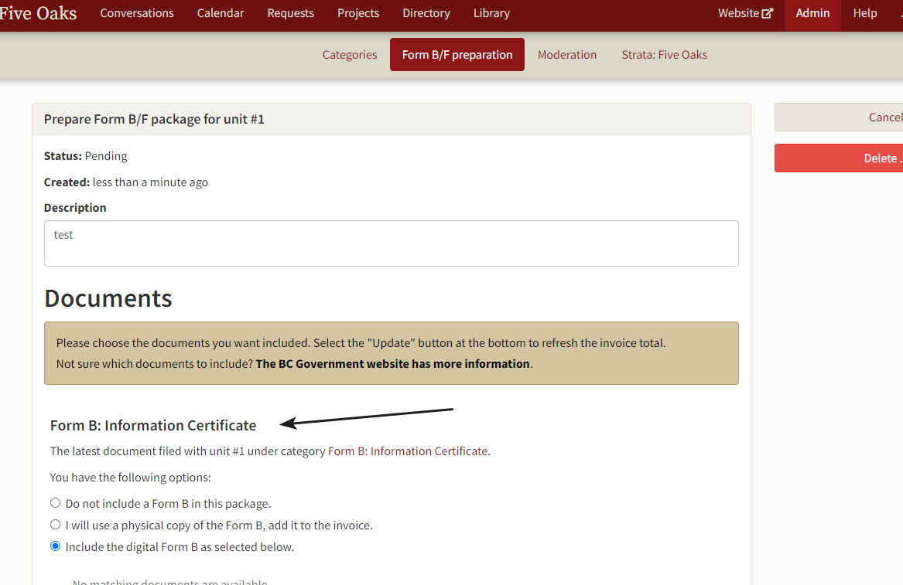
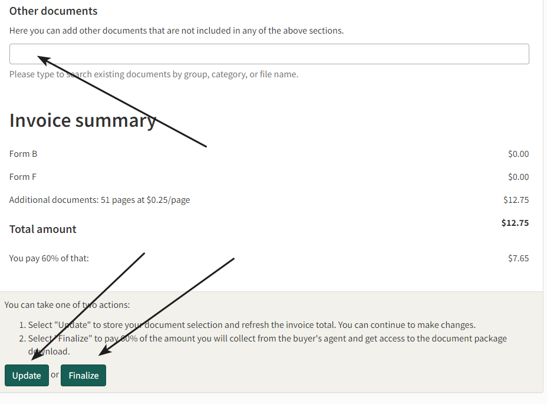
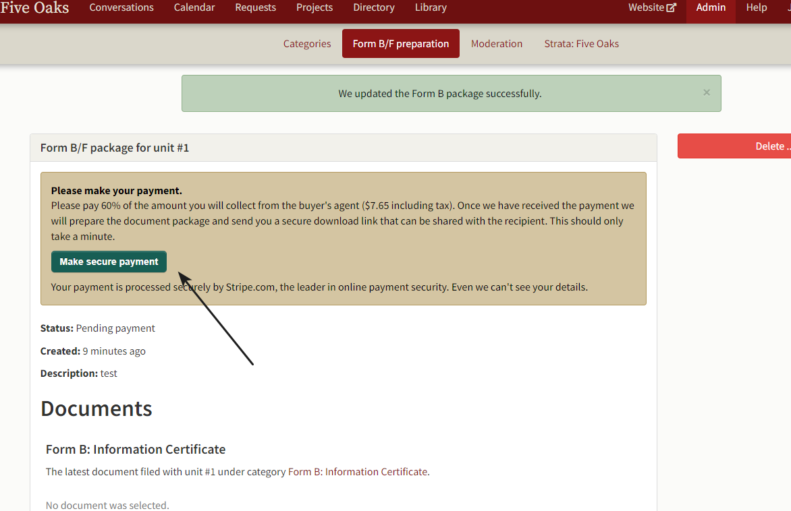

# Form B and Form F document support.

*How do I use your Form B or F Service?*

The Organizer provides a way for you to easily collect documents and package them for the Form B Information Certificate or F Certificate of Payment. 

This service depends on how your strata has filed library documents.  There are a number of default Organizer categories that the Form B or F routine uses.  For example, your depreciation report should be filed under the category Depreciation report when you're loading it to the library.  

The Organizer will not prepare your actual Form B/F document; your council or property management must do this.  The Condominium Home Owner's Association provides the following templates:

https://www.choa.bc.ca/wp-content/uploads/Form-B-Information-Certificate.pdf

https://www.choa.bc.ca/wp-content/uploads/Form-F-Certificate-of-Payment.pdf

To prepare Form B or F documentation, click on **Admin**:

Then click on **Form B/F preparation**:

The following screen will open showing the Form B/F preparations you've completed in the past (it will be blank if this is your first.)  Click on **Prepare new Form B/F package.**

which opens a screen to choose the unit that needs a form B or F (or both) and to make a comment for reference.  When you've done this, click on **Next step: Select documents**:

The following screen will open and you may select the files you wish to include.  

At the top of the document list, you're given an option to choose Form B or Form F (or both) and whether or not you want the certificate you may have uploaded to the library included.  Scroll down through the document screen and click on the items you wish to include.  The screen automatically includes documents filed under categories required by the Strata Property Act.  There is also an option at the end of the list to enter files not showing on the list but in your library.  When you're done click on **Update or Finalize**.  Update will recalculate the invoice and Finalize prepares the package.

The final screen looks like:

If you are a subscriber to the Organizer, please contact StrataCommons at contact@stratacommons.ca and we will waive the fee.  The Organizer will send you a link that you can email to the realtor or lawyer.  (Clicking on the email link will download the documents in a zip file to your machine.)  The Organizer will also create a document you may use as an invoice with the cost of the Form B and number of pages.  

