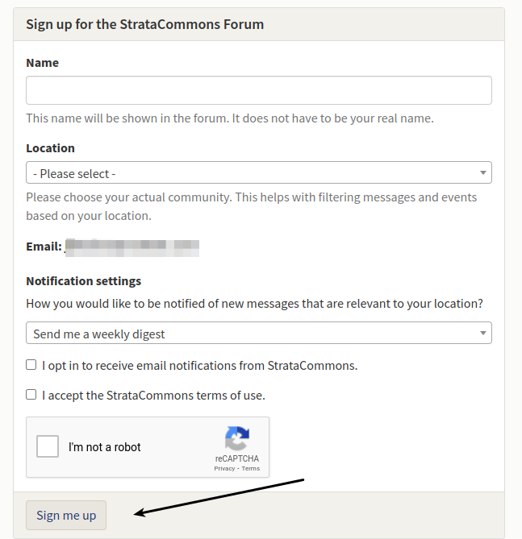
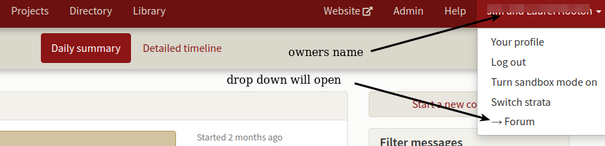

### How to help your owners access the Forum.

*We have owners who want to join the StrataCommons Forum.  How do we do this?*  

Have your owners click on the following link or they can go to our web page and scroll down to the Forum section.

https://stratacommons.ca/forum

Our Forum page should open up and the header looks like:

Scroll to the bottom of the page and then click on the Forum sign up.  

Once your owners have filled in the form and ticked the boxes, they can click on the **Sign me up** box at the bottom.   They'll get directions on how to set up an account and can sign in.  

Owners can use their current strata Organizer account and password if they wish.  This will allow them to move back and forth between the Organizer and the Forum without logging in again.

