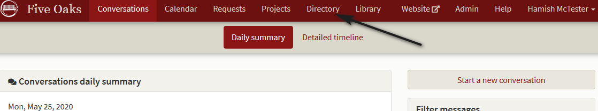
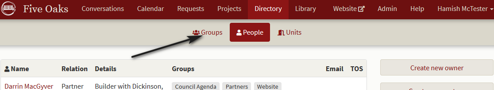
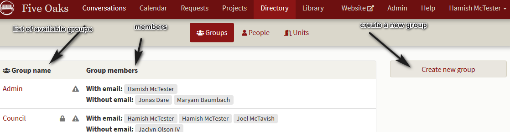
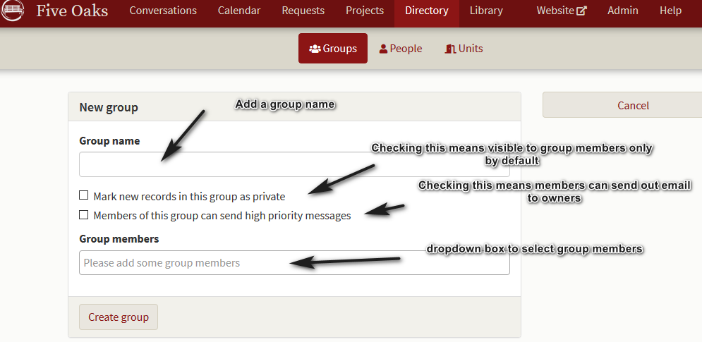
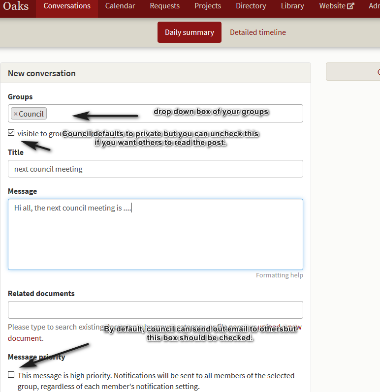

# How to setup and use groups.

*Our strata has a number of committees and recreation groups.  How can we set up the Organizer to help them?*

Choose the **Directory** service from the **Conversation** page.  

Once you are in the **Directory** service, choose **Groups**

and the group detail screen opens.  

You can see at a glance what groups are available and who you've already assigned to each group.  (Assigning people to groups is done in the **Directory** under **People.**)  Notice the **Create new group** button available on the far right.  Clicking this will allow you to add additional groups that are not set up by default. The new group screen looks as follows:

Once you've set up the group, click on **Create group** and you're done.  Each time you create a new record, you get the opportunity to assign it to any of the groups that come standard with the software or new groups you've created.  

Marking a group's records as private prevents anyone who is not a group member from seeing the document, calendar event, project etc.  You are given the opportunity to uncheck this if you prefer.  This means other groups may view the record but they can not change it.

The following is an example of creating a new conversation and assigning groups, privacy and sending out an email.

