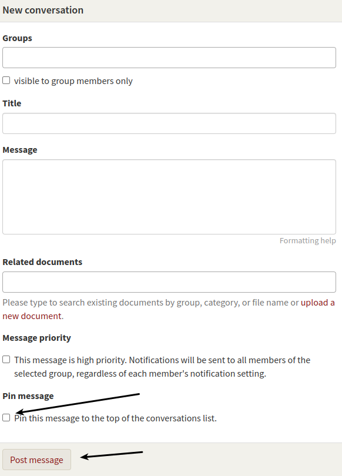
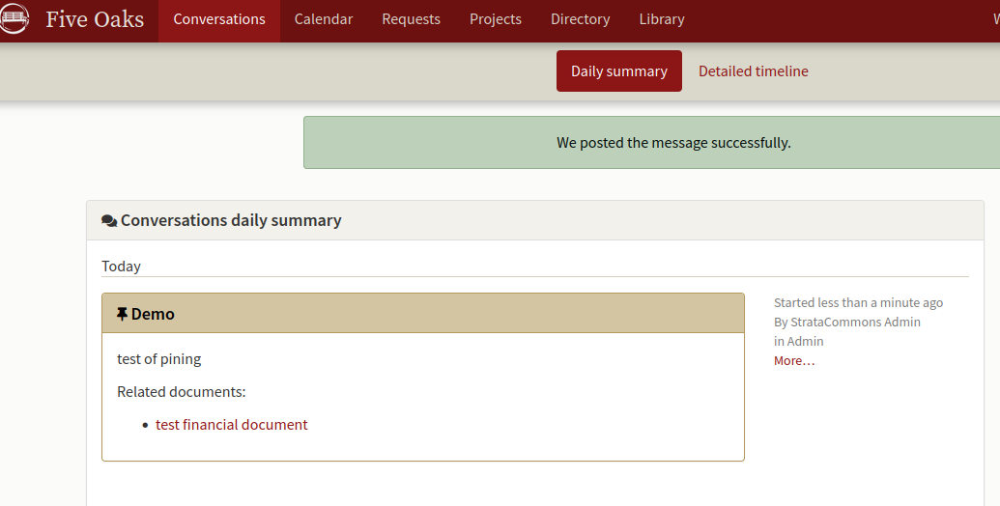
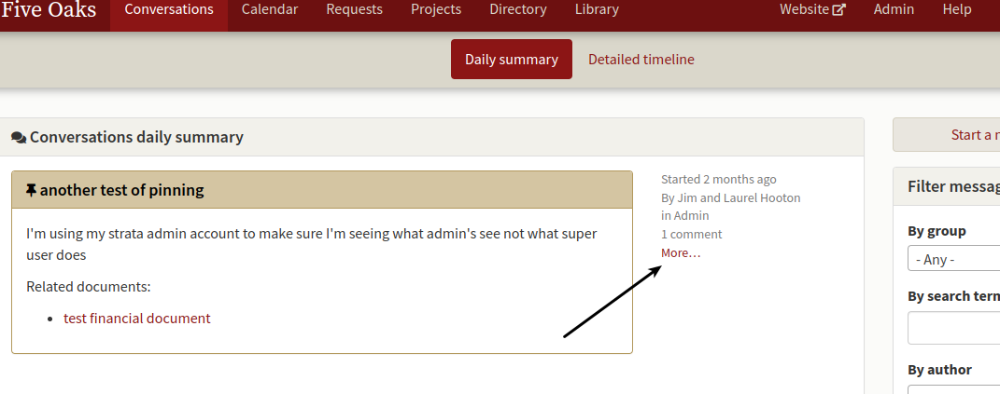
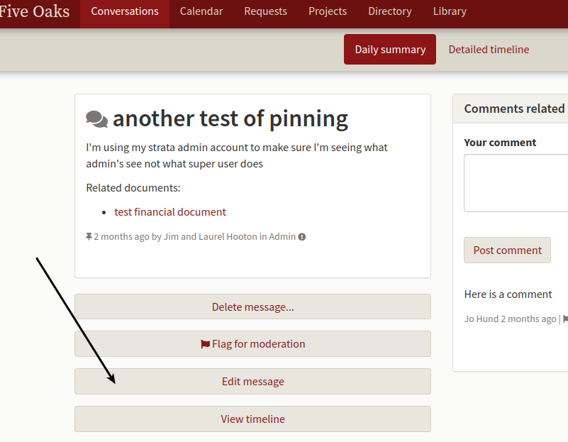
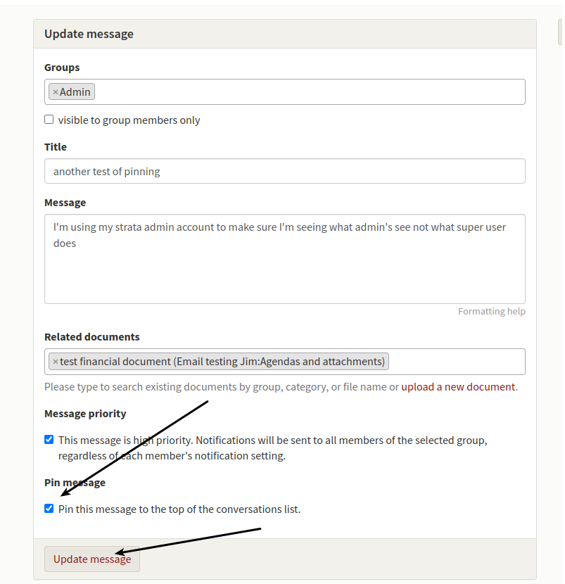

# Pinning an important conversation.

*My council wants to keep the AGM documents at the top of the message board for the next couple of weeks.  How do I do this?*

A new posting will normally push the last item down the screen and eventually that item will disappear. The pin option will allow you to keep a message at the top of the board until you unpin it.

Two quick caveats: only web admins can pin, secondly, you don't want to pin too many documents or you'll fill the screen. 

After you start a new conversation, scroll to the bottom of the screen and click on **Pin message** and then save the message as you would normally.

The pinned document will look like:

To unpin a conversation, first click on **More** on the main screen:

When the full conversation screen opens, click on edit message and the editing screen will open.

With the editing screen open, click and remove the check beside Pin this Message and then click update message.

