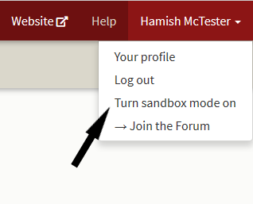
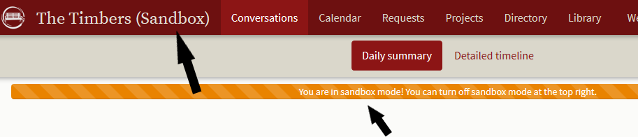
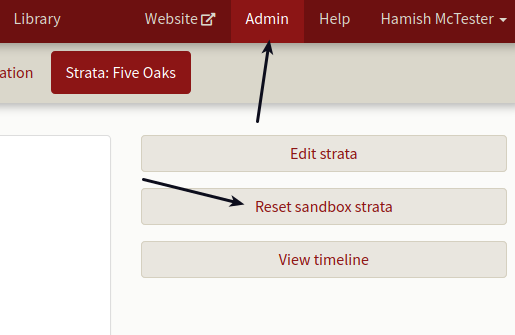
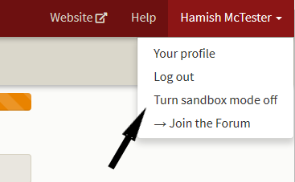

# Sandbox mode.

*As our strata organizer admin, I want to test and experiment with the web service.  How do I do that?*

To start Sandbox Mode click on your name on the far right of the top menu bar.   In the drop down menu, click on **Turn sandbox mode on**.  

The screen will change and you'll see the word "(Sandbox)" on the top beside your strata name and an orange bar below the title bar indicating you're in sandbox mode.

To reset your sandbox, click on **Admin** in the main menu bar 

and a screen opens showing the **Reset sandbox strata** button.  Everything you've done in the sandbox is erased.

To turn the sandbox mode off, click on your name on the far right of the top menu bar.  In the drop down menu, click on **Turn sandbox mode off**.

