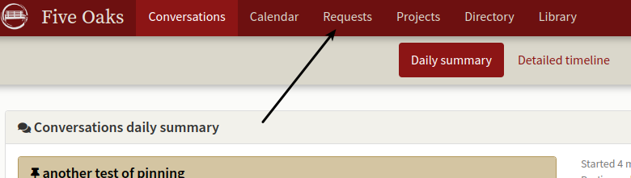

# Single user communication.

*We want to send an email to one of our users.  How does your software handle single user (non-group) communication?*

In general, the principle behind the Organizer is group communication and the creation of a corporate record.  It is not meant to replace email services so there are no options for individual conversation.  Most stratas use owners' home email for such things.

The Organizer has a service called requests available on the main menu which allows an owner to register a work order for example or ask other one off type questions.  

This is then forwarded to the group responsible (which may also be an individual - groups can have one person in them.)  The biggest use of this is with gardening or facilities related requests.  Communication in the Request service is between the user making the request and the group responsible for the request.  It is not posted on the communications board.

