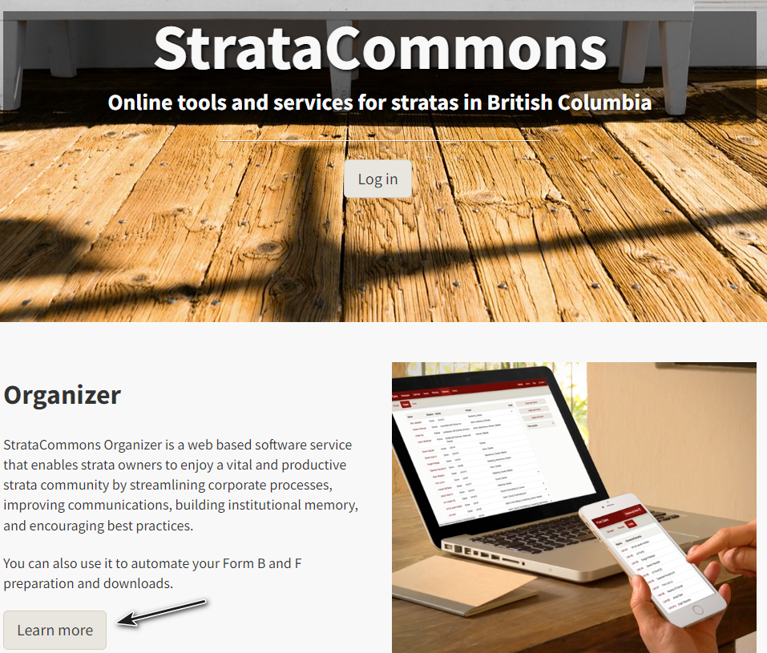
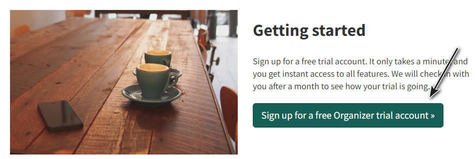
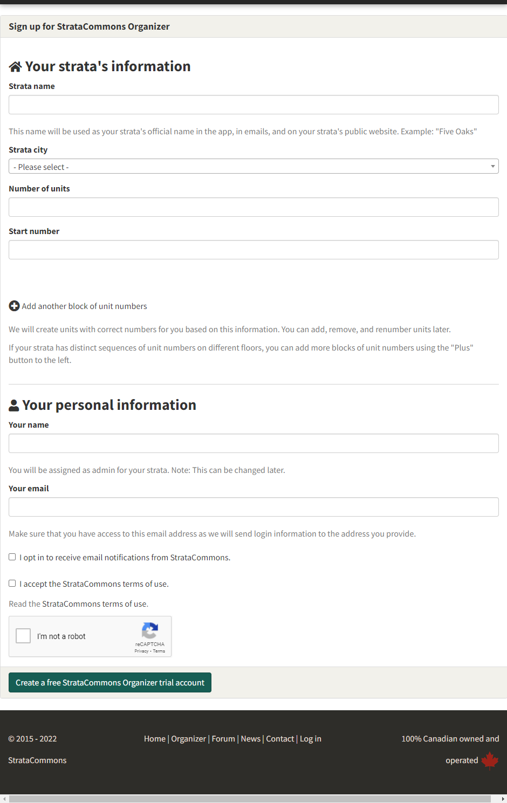
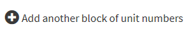
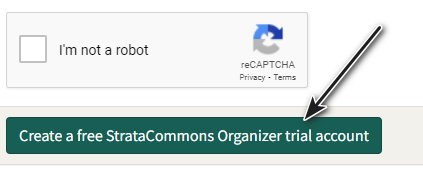
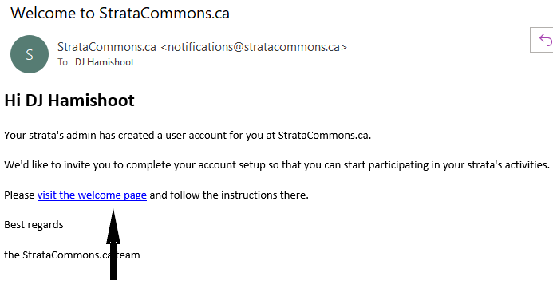
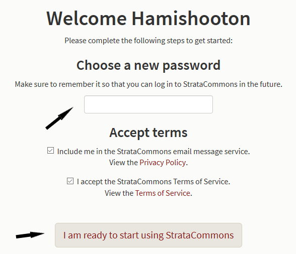

### How to create an account and start your strata.

*Our strata would like to set up an account and have a look at your service.  How do we do that?*

Go to our website at [https://stratacommons.ca/home](https://stratacommons.ca/home)

Under the **Organizer** on the main page click on **Learn more**

 

Scroll to the bottom of the page that opens and click on **Sign up for a free Organizer trial account.**

 

A form opens called **Your strata's information**

 

Fill in your strata name

Select a city from drop down list

Add the number of units and the start number for the units.  Note that you can add additional "blocks' of numbers for the situation where your strata number does not have one string of continuous unit numbers.  So for example, you have four floors and each floor starts with unit 101, unit 201, unit 301, unit 401 and ends with 10 units per floor.  Click on the 

 

and a new block will open for each floor.

Add your full name and email and then check off the boxes **I opt in to receive email notifications from StrataCommons** and **I accept the StrataCommons terms of use.**  Please review the terms of use found underneath the **I accept the StrataCommons terms of use** check box.  Finally please complete the **I'm not a robot** check box.

Finally click on **Create a free StrataCommons Organizer trial account** and a page will show indicating that you've successfully signed up and an email is on its way.

 

We send the email to the address you gave us on the set up screen.  The email will look like:

 

Click on the hyperlink in the email that says **please visit the welcome page and follow the instructions there.**  

 

StrataCommons asks you to enter a password which you should do.  *Please record this password for future use* and click on **Include me in the StrataCommons email service** and **I accept the StrataCommons Terms of Service** When you're ready, click on **I am ready to start using StrataCommons.**  Your strata's Conversation service will open and you can begin to use your strata account.

