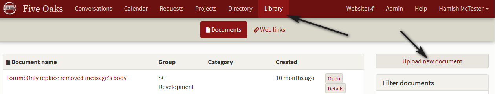
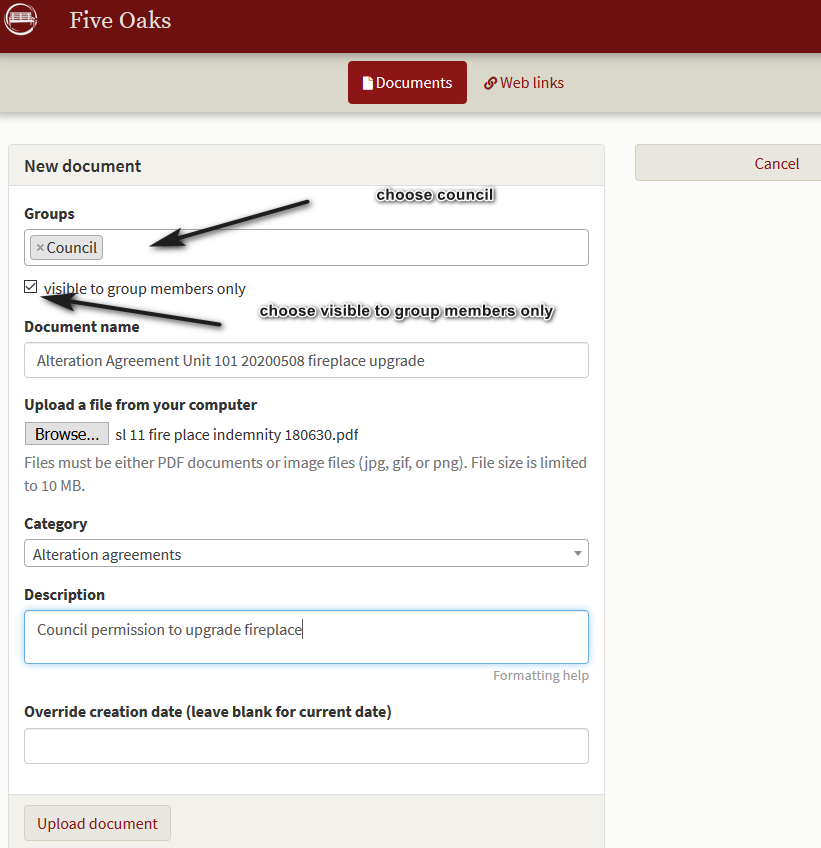
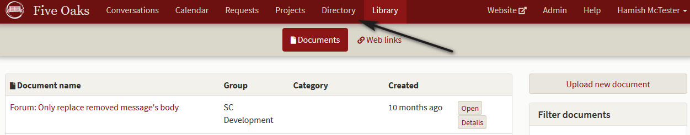
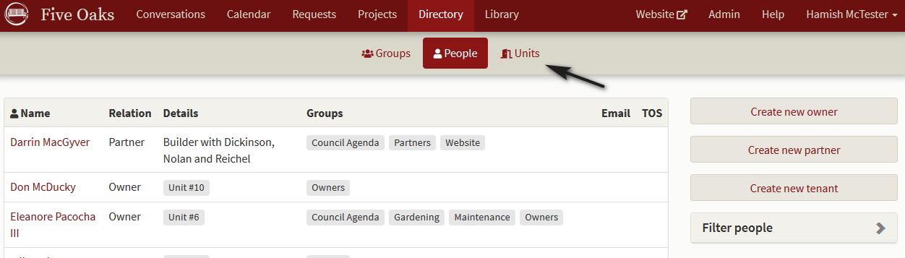
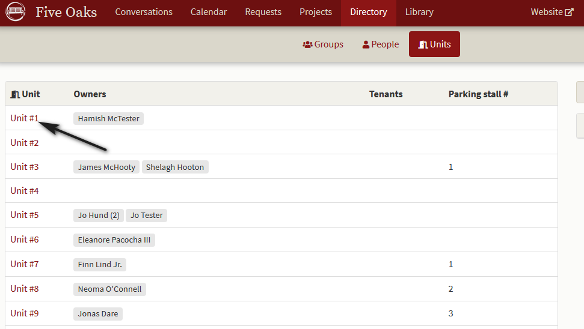
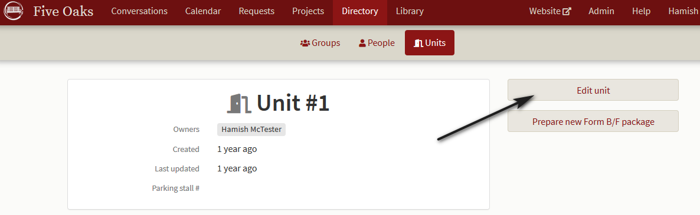
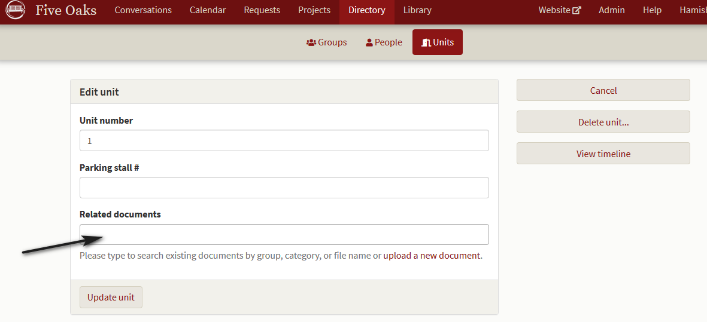

# How to attach documents to a unit.

*We've had an owner submit an alteration and indemnity agreement to make a significant change to the strata.  How do we track this for future form B's?*

Use the usual process (see help files) for loading a document into the library.  

In that process, mark the document as part of the category **Council** and uncheck the **visible to group** box.

Save the document as usual and then choose the **Directory** service.

When the main directory screen opens, choose **Units** and the unit screen opens.

The **Unit** screen will open and you should click on the particular unit number (not the owner's name) you to which you wish to attach the document.

The individual unit information screen opens and you may click on **Edit unit.**

The edit screen opens and you may click on **Related documents**.   

A drop down box opens showing the most recent files loaded in the **Library**.  Click on the document you wish to attach to the unit and then click on **Update unit** and the document is attached.  Only members of council and the owner may see these and they will show up in the Form B production process for a new owner.

 
