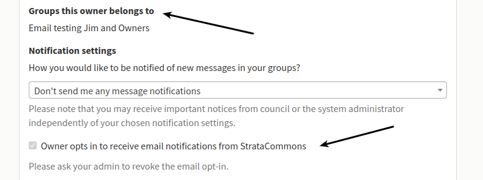

# Locking the Directory

*Can we lock certain information in the directory so owners can't change it?*

No, we designed the software so owners could update their own personal information which makes them responsible for its accuracy.  There are a couple of exceptions and owners will have to contact their Admin to change.  These include:

