# StrataCommons Manual.
{: .no_toc }

## Table of contents
{: .no_toc .text-delta }

1. TOC
{:toc}

## Organizer purpose

The purpose of this web application is to create a permanent and easily accessible record of Strata Corporation business.  The software will help promote best practice, make information readily available and facilitate communication.   All records are by design meant to be *permanent and available* to all owners and to a lesser extent partners or tenants.  Documents and messages are not removed easily (unless they are in violation of StrataCommons privacy policy, the BC privacy act or the BC Human Rights Code.)

This means you should engage thoughtfully with the software remembering you are contributing to the official record and history of your Strata Corporation and what you post for the most part will be available to other participants.

## General Information

### Basic conventions

**Bold** text represents titles, boxes or buttons in the software.  Text in *italics* is for emphasis.
### Best browser

After testing most available browsers, there is no one that works better than others. Firefox, Chrome, Explorer, Edge and Safari all work well.  Please note your browser contains settings that control how or if web documents are displayed.  These settings are not under StrataCommons control and are different for each browser.

### Responsive design

The software utilizes "responsive design" to adapt its appearance depending on the size of the browser display on your web application.  These help files assume you are using a full (or 2/3 full) screen web browser program (Explorer, Chrome etc.) on your desktop or laptop computer.  If your screen window is less than 2/3, the software adjusts to fit as much as it can across the top.  Additional menu items will show up when you click the hamburger icon the right.  Those using a hand held device will need to click on the "hamburger" icon on the right to show menus.  Here's a screen shot showing a smaller desktop screen with the hamburgher:

")

In addition, most titles and fields have helpful notes and comments that will pop up when you hover your mouse over them.  

### Groups, categories and services

The software is organized by groups, categories and services.  *Services* are shown across the top of the web page and underneath the browsers bookmarks or command tool bar as a horizontal series of headers. These headers include  **Conversations, Calendar, Requests, Directory, Library, Website, Help and User Name.  If you are your strata's web administrator you will also see Admin.**

") 

*Groups* may include owners, tenants, and council, gardening committee, maintenance or others.  The StrataCommons Organizer web administrator will add you to these groups as appropriate.  As well, the Strata may ask their web administrator to add customized groups to better reflect the organizational structure of the Strata and add the appropriate group members.  Some of these might include adding for example, web site management, maintenance, gardening, social etc.  It is a valuable time saving exercise for the Strata Council to consider what groups make sense early in the set up process but these can be added at any time.

*Categories* include a significant list set by default.  The B.C. Strata Property Act requires certain documents for preparing the Form B Information Certificate and outlines what strata files should be kept permanently and those that should be purged over time.  Using these default categories makes this easy.  Again, the Strata may choose to add additional categories.  As with *Groups*, it is very helpful for the Strata Council to think ahead considering that categories will be used by everyone to file documents in the library - a good set of categories will make quick location of documents easier for users.

### Home email

Designated owners (usually on Council and the System Administrator) may post a message to your home email account to facilitate communication.  This notification will appear in the conversation service and in your personal email box.  Documents may also be attached to these notices and may be viewed in your browser but users must be logged into StrataCommons Organizer web site for security reasons.  This allows for easy transfer of minutes, financial statements etc.  The system will also send you a digest of activity in your group(s) according to the frequency you requested when you signed on the system.  You may change this frequency at any time - please see the help section called **Your Profile**

These messages are a **no reply** service.  Should a user wish to comment, they may log into the web service and click on the message in the conversation board and a screen will open inviting remarks.  All those using the system may see theses comments.  The software includes settings by group for privacy which means that only group members can see the messages posted affording some level of confidentiality for a group discussion and is most commonly used by the group "Council."

### First time log In

Your web administrator will send you an email inviting you to join StrataCommons Organizer and clicking on the link in the email will take you to the initial sign in screen.  The following shows a typical invitation as it would appear in a google mail account:

")

Click on the **visit the welcome page** link in the email to see the welcome page and sign up.  To protect your privacy, the web application will ask you to set your password on this screen.  Please check off the boxes giving StrataCommons Organizer the right to send you email and indicating you accept the agreement for use.  Please remember your password although should you forget StrataCommons Organizer can send you a temporary one that you can use to create a new one.  

")

Once you've completed the form, click on **I am ready to start using StrataCommons** button and the software will take you to your StrataCommons Organizer site.

Once you've moved to the Organizer site, you may want to create a bookmark.  Creating a bookmark depends on the browser you are using but it will save the site for future visits.  As an alternative, you may also type in *StrataCommons.ca* in your web browser and press enter to see the StrataCommons Web Site. (At this point, it would be wise for you to create a bookmark.)  Click on **log in** found on the top right of the site to return to the Organizer.  The site will remember you for a period of time and you will not have to re-enter your credentials when you return.

### Changing personal information

StrataCommons Organizer allows individual users or Owners to update their personal information including phone number, unit number and email.  Clicking on the hamburger icon and then clicking on your user name at the bottom of the menu or if you are in desktop mode click on your user name on the far right.  

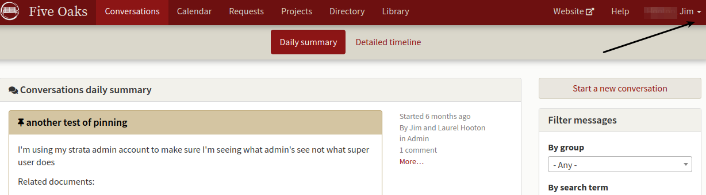

This will drop down three choices: **Your Profile**, **Log out** and **Turn sandbox mode on.**

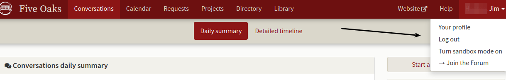

#### Your Profile

Clicking on your profile will open a screen that shows a series of boxes allowing you  to change your **Name**, **Email** address, your **Password**, **Unit**, add a **Phone #** and change your **Notification Settings** if you wish. Click on any of these and enter the new information.  You will also see the **Groups** your system administrator has added you into.   

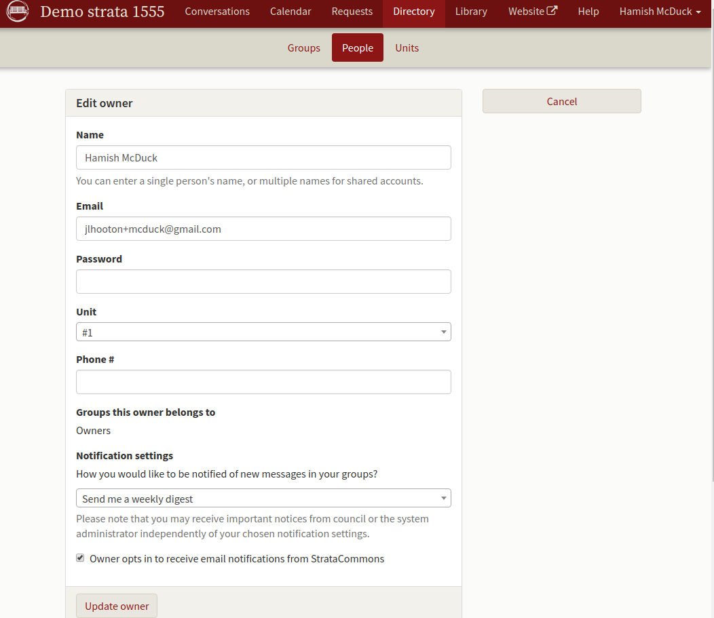

The **Unit** box opens a drop down list of the units in your strata and you must choose one of these.  Contact your system administrator if there are other issues related to these changes such as a change to the groups you belong to or you are moving out of the Strata. Finally you may uncheck the **Owner opts in to receive email notifications from StrataCommons** box.  If you do this, you will no longer receive messages from the Strata directly to your home email box.  These will still be available to you on the conversation board.  Finally, click on **Update owner** and the system will make these changes.

**Notification settings**

In addition, the Organizer can send you a digest of postings happening in your region. When you first signed up for the service, you selected a delivery frequency but if you would like to change this, click on Notification settings in your profile. Use the drop down box to set the delivery frequency to weekly, daily, immediately or never. Click on Update user and the system will make the change.

### Practise or sandbox mode

StrataCommons Organizer has created a "sandbox" mode.  The sandbox is a safe place for you to learn the software without adding to the official strata records.  What is entered into the sandbox can and will be removed on a regular basis.  You know you are in the *sandbox* because it has orange bars top and bottom.  See the following screenshot.

")

The default is the live strata service not sandbox.  If you wish to change from one to the other, you may click on your name in the services bar and then click on **Turn sandbox mode "off" or "on".**  StrataCommons Organizer remembers what mode you were in and by default returns you to either the site or the sandbox.

### Resetting a password

If a you forget your password, there is a reset password feature in the software.  After you click on **Sign in** on the StrataCommons web page, click on **Forgot password?** under the **Log in** button.  A **Reset your password** box opens asking you to enter the email you use for StrataCommons Organizer (most likely your home email.)  After you have entered your email address, click on "Send me the email."  StrataCommons will send an email with a link.  Clicking  on the link will take you to a StrataCommons screen asking you to enter your new password.  The link has a time limit so may not work after a day or so - if this happens, please ask for another reset.

### Logging off

You may simply close your browsers window and then if you return to the website within the next several weeks, you will be logged back in automatically. If you want to log off the site, click on your user name in the right hand top  corner and select the option to **Log out**.  After you **Log out** and you return to the site, you will have to re-enter your credentials.

")

## Conversation service

The first screen that appears when you enter the web application is the conversation service which looks like the following (your messages may be different!):

") 

All of the conversation topics relating to the groups you belong to are shown by default in most recent date order.

The main message screen is divided into two parts.  On the right hand side of the screen you will see a button to start a new conversation and underneath that a heading called **Filter** messages which allows you to control what you see in the left column.

On the left under the title of **Messages** are all of the communications available for your review.  These are organized in time order by topic. To the right is a note showing the number of days since the posting, the author, the group and a note on number of comments if there are any.  You can also see a highlight button called **more** which allows you to open a new window and see the full posting including comments by others as well as a place for you to add your comment.  When you've made your comment click on **Post comment** and your note will be added.  This screen looks like:

") 

### New conversation

To move from a detailed screen such as posting a comment back to the main conversation screen and create a new message, click on the conversation service in the title bar.  This applies to moving back and forth in any service.

Clicking on the **start new conversation** button found on the top right hand side of the main conversation screen, will open the new message box.  Once the new screen opens, there is a **Cancel** button on the right hand top if you change your mind.

The new conversation box contains several choices and looks like:

")

#### Group

Click your mouse in the box under **Group** and a list of all of the strata groups available will drop down.  You may choose one group or several but only the groups you belong to are available for you to choose from.  

#### Privacy.

Clicking the box that says **visible to group members only** means the message is private to your group and will only be seen by group members.  Please note that if the group is "owners" clicking on the **visible to group members only** box means everyone in the strata can see this message except for tenants and partners.

One purpose of this software is to enhance communication, so we recommend the privacy option be used only when necessary.

#### Title

Fill in a title for your message by clicking on this box.  This is similar to the *re:* used in most written communication.

#### Message.

Fill in your message.  You may format your message using *mark down* language which you may learn about by clicking on the **Formatting help** letters at the bottom right of the box but this is optional.  Clicking on the **Formatting help** letters under the message will show what symbols to enter for underline or bold etc.

#### Related documents.

You may attach a file to your message by placing your cursor in the **related documents** box. By default, the most recent documents loaded in the **Library service** appear in date order.  As well, if the file is already in the StrataCommons Organizer library, you may find the file by typing the first few letters of the name, group or category until the right file shows up.  As you type, the most recent files on the website will appear to a maximum of 10 that match your search criteria.

You may also upload a new file if you wish by clicking on **upload a new document**.  This screen has a number of options for your use which include:

#### Upload a file from your computer

Clicking on **Choose File** will open a file manager showing your computer filing system.  Navigate through your file manager to find the document you wish to upload.

#### PDF please!

You may only load *PDF files* to ensure others can read the material in other users' web browser.  Word processor files can not be read on the screen.  Most browsers have a built in PDF viewer that will work well.

#### Category

Clicking on the **- Please choose -** button will open a list of available categories to help with file retrieval and purging.  Please select one.

#### Description

Click in the **Description** box and enter a one or two sentence detailed description of the document to help other users know if this is the document that will be of most assistance to them.

#### Override creation date (leave blank for current date)

Clicking on this box will open a calendar that you may use if you for some reason you want the date of creation on StrataCommons Organizer to be different than today's date.  This is useful if the system admin person is entering historical documents that originate much earlier than the current date.  The original A.G.M. minutes for example created several years earlier should show later in the time sensitive listing.

At the bottom of these choices, there is an **upload new document ** button.  Click on this and StrataCommons Organizer will upload your document and take you back to the **New Message** screen with the document loaded in the **Related documents** box.

Uploading a new document will also add this document to the Library service as well.

#### Send comment to the group

Finally, click on this button to post your message.

### Filtering messages 

StrataCommons Organizer uses a similar search function in all its services called **Filter messages** (right hand side top under **Start a new conversation** which allows you to enter a search parameter in any of the following drop down boxes:

")

**By group:**  If you click in the **By groups** box, a list of the groups you belong too will appear.  Clicking on any particular group will show only messages for that group.

**By search term:**  You may enter a search term in the **By search term** box by typing the letters of the word you're looking for. The search box will search as you type and show messages that contain this word.  If you delete the word, all documents will reappear.

**By author:**  You may select messages written by a specific strata partner, owner or renter by clicking in the box **By author**.  This will open a list of all strata owners, partners or renters - choose one and you will see messages posted by that author.

**By date:**  You may select messages **By date** as well.  Clicking in the box **Posted after** will let you choose either **Posted after** or **Posted before**.  Then click on the box to the right and a calendar will appear showing today's date.  You may choose any date that suits and click on **use this date** to filter messages before or after your choice.

**Reset filters:**  Finally at the bottom right there is a box titled "Reset Filters" for you to return to the defaults.

## The calendar service

The **Calendar Service** button is found on the top bar of the web site once you have subscribed to StrataCommons Organizer ((This assumes your computer’s browser is mostly full screen.  If you’re using a tablet or your browser is partial screen, click on the three lines on the far right of the top bar to expand the main menu.)  

")

When you click on this, a monthly calendar appears showing all of the events happening for the month in the Strata.  The Calendar is organized differently than other services because it needs most of the screen so you can see clearly what's on for the month.  

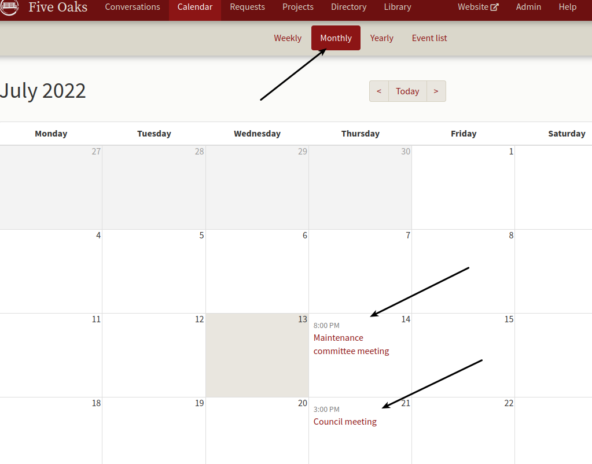

You may enter a new event, view events by day, month, year or as a list.  As well you may scroll through the calendar to look to the past or ahead to the future. 

Beneath the services bar at the top of the web page, you will see four titles **Weekly, Monthly, Yearly and Event list**.  By clicking your mouse on any of these you may choose how the calendar appears.  The Weekly calendar will allow you to see more details in an entry while the Monthly or Yearly calendar lets you see a great time span at a glance.  Choosing **Event List** shows strata events in a linear list.

### Calendar viewing

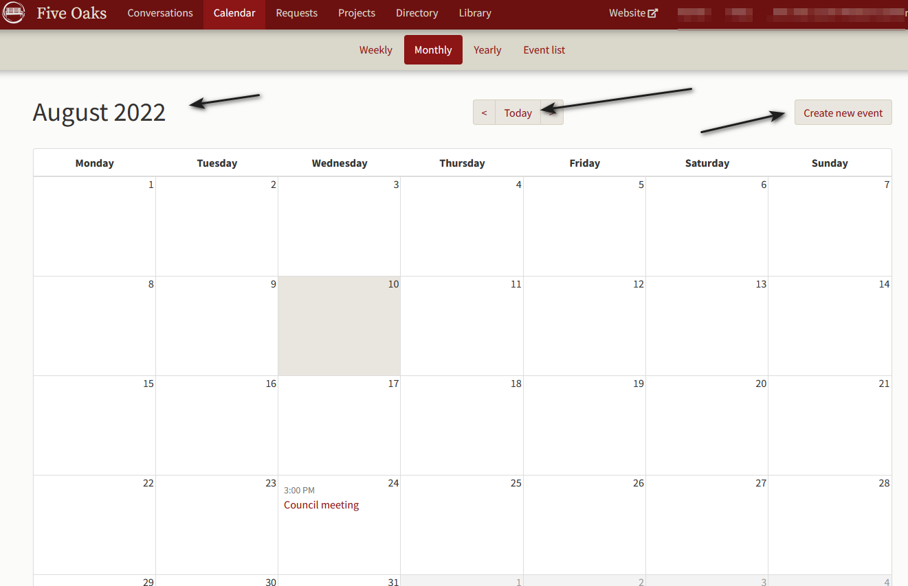

If you choose to view the calendar with one of the selections in the bar (except for **Event list**,) you will see the calendar with the month and year in the left hand upper corner, a bar with **Today** in the centre and left and right arrows and a **Create new event** button.  By clicking on the arrows on each side of the **Today** button you may view new calendar pages for the week, month or year either in the future or the past.  Clicking on the **Today** button will take you back to the week, month or year that will display today's date which is always shaded.  Clicking on **New event** will open the screen to create a new calendar event.

If you choose to view the event list you will see a linear list of calendar events in the left column, sorted with the event in the near future at the top.  On the right you will see a **Create new event** button and a **Filter events** button similar to the set up in messages.

### Creating a new event

In any view, you may select the **New event** button on the top right hand side and a **New event** box will open. 

")

The **New event** box contains several choices including a **Cancel** button on the right hand top.

")

#### Group

Clicking in the **Group** box  will give you a list of all of the strata groups available for your event.  Choose at least one group but you can add as many as you like.

#### visible to group members only

Clicking this box means the event may only be seen by other group members and a message will only be posted for those in the group.  Please note that if the group is *owners* everyone in the strata may see it.  

#### Event name

Type in a descriptive name for the event such as the Strata Annual General Meeting.

#### Event date and time

Clicking on this box will open a box that shows a calendar on the left and a digital clock on the right.  You may choose a start date for the event and then a time by hours and 15 minute intervals.  You should choose **Am** or **PM** and then click **Use this date** to continue.

#### Location

Enter the meeting location in the text box.

#### Description

By clicking in the **Description** text box, you may add an explanation related to the meeting.

#### Create new event

Finally click on the **Create new event** box at the bottom to create your new calendar entry.  A new box will open allowing you to comment to group members that a new event has been added to the calendar and the software will post a note on the message board.  This will appear in the digest.

### Filtering events

")

You may filter events on the calendar by clicking on **Event list** at the top of the calendar.  This view includes the filtering functions.  StrataCommons Organizer uses a similar search function in all its services found by clicking on **Filter events** (right hand side top under **Create new event** which allows you to enter a search parameter in any of the following drop down boxes:

[Filter details](#Filters)

## The request service

Located on the main menu at the top of the web application there is a tab called **Requests**.  (This assumes your computer’s browser is mostly full screen.  If you’re using a tablet or your browser is partial screen, click on the three lines on the far right of the top bar to expand the main menu.)  This tab will allow owners to put a common property request that needs addressing by Council on record.  The web application allows Council or the Strata Manager to track this, those involved, dates and final resolution of the request.

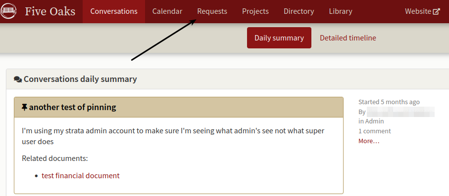

### Requests differ from conversations

Requests do not appear in the conversation service.  An individual owner can request something from those council groups responsible to manage that particular concern.  All owners may see all requests if they log into the web site and open the request service unless the **visible to submitter and group members only** box is checked.  In addition councils can add a variety of details concerning the request, assign it to an individual and close the request when completed.

An Example:

If an owner should discover a broken tile or shingle on their common property roof, they could go on to the web application and choose **Requests.**

When you first click on **Requests** a window will open showing all of the current concerns under review.  If the owner's issue is already listed, they may click on the request and a new window will open allowing them to add a comment such as "there is another broken tile on unit such and such..."  The council point of contact or the Property Manager will receive the comment and can add this to their review of the situation.

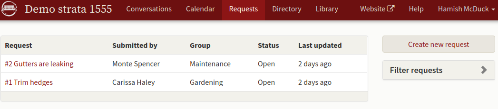

### Creating a new request

If the specific concern isn't already on the board, an owner may click on the **Create new request** button at the far right which will open a new window with the following options available.

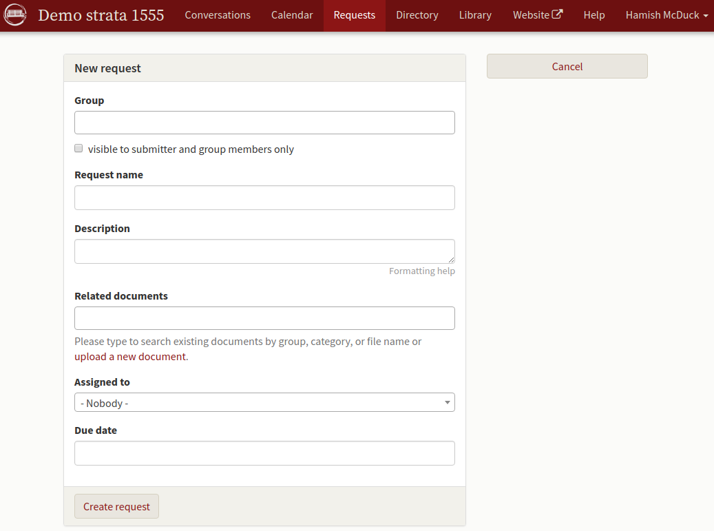

#### Group

By clicking their cursor in the box titled **Group** a drop down list of the available service areas appears.  These areas include Council and System Admin by default.

**Note**

Other areas that stratas have found helpful include:

- By-laws

- Garden Beds

- Lawn and Hedges

- Maintenance

- Miscellaneous

- Minutes and Finance

Your system administrator can add new groups and add individuals to those groups who would deal with such issues.

An owner should choose the one that best fits their concern so in this case, it would be Maintenance.

#### Request name

Provide a title for the work order or issue you wish to raise such as "broken roof tiles."

#### Description

Enter a description of the request.  The box will expand as you type so enter as much information as is necessary to communicate clearly.

#### Related documents

You may attach a file to your request by placing your cursor in the **related documents** box. The most recent documents in the library will appear automatically.  If the document is already in the StrataCommons Organizer library but doesn't appear in the first "top ten", you may find the file by typing the first few letters of the name, group or category until the right file shows up.  As you type, the most recent files on the website will appear to a maximum of 10 that match your search criteria.  As well, you may also upload a new file if you wish by clicking on **upload a new file**.

When the owner has written up their request, they should click on **Create request** and the web application will take action.  The council group assigned to look after Maintenance will be notified in their email digest that an owner has something that needs attention.

## The Directory service

This service is found on the top right of the menu bar in normal screen mode between the Message Service and the Library.  

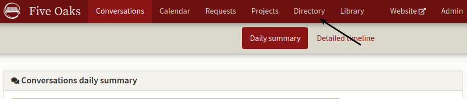

Clicking on the bar opens up a new screen that by defaults shows the **People** in the Strata.  You'll also notice sub titles with **Groups**, **People** and **Units** on the top.

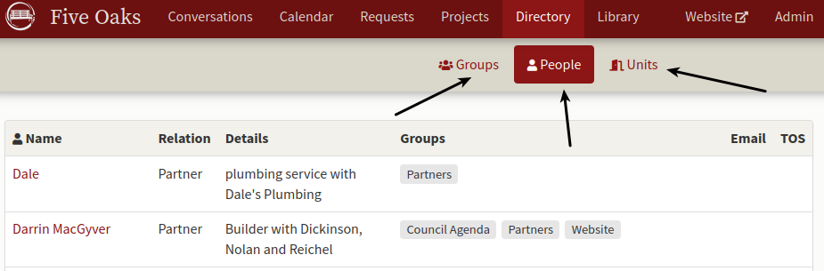

### People

This service is the address book for your Strata.  In the **People** screen, everyone who signs on to the web application will have their name, relationship to the Corporation, details (most often the unit number) and a check mark under **Email** if they've agreed to receive announcements to their home email.  

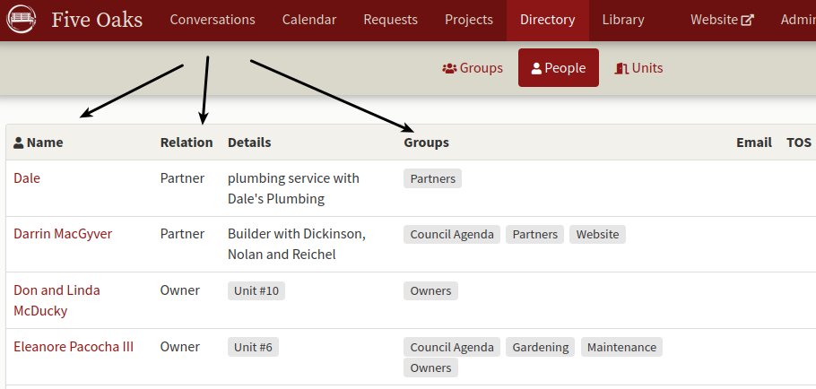

The **Relation** column shows the nature of the connection to the Corporation such as an **Owner**, **Tenant** or **Partner.**  (A Partner might be your gardener or maintenance person or other business associate working with the Corporation.)  In addition, the Directory shows what groups individuals belong to such as Council or the Gardening Committee.  For more details concerning an individual, click on their name in the left hand column for their address and email along with details about accepting the terms of service and when they became part of the web site.

In addition, you will see a **Filter people** option on the right of your screen.  

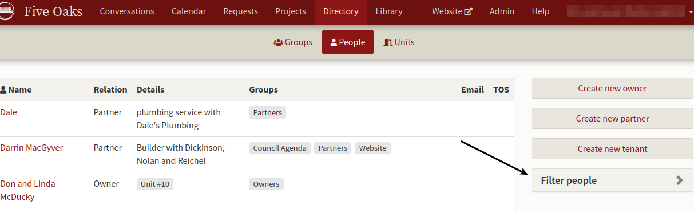

Clicking on the **Filter people** box opens a drop down menu that lets you quickly enter different ways to see the directory.  

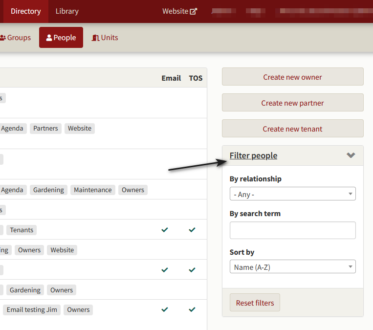

You may choose to list individuals **By relationship** (Owners, Partners or Tenants) by any search term you enter and finally you can sort by A-Z or Z-A.  You may enter information in all of the boxes.  The software is interactive so will begin to sift and sort as you enter data.  You also have access to a **Reset Filters** button below the **Filter people** box.

### Groups

Clicking on the **Groups ** button displays a three column chart that shows **Group name** *a spot for icons* and **Group members** which will show users in the group and if they use email or not.  Several **Groups** are set up by the software automatically (Admin, Owners, Partners, Tenants and Council) but the rest can be established by your web site Admin person to reflect the Strata's organizational structure.  These may be committees or working groups.  In addition, your Admin person can set the group's default privacy mode.

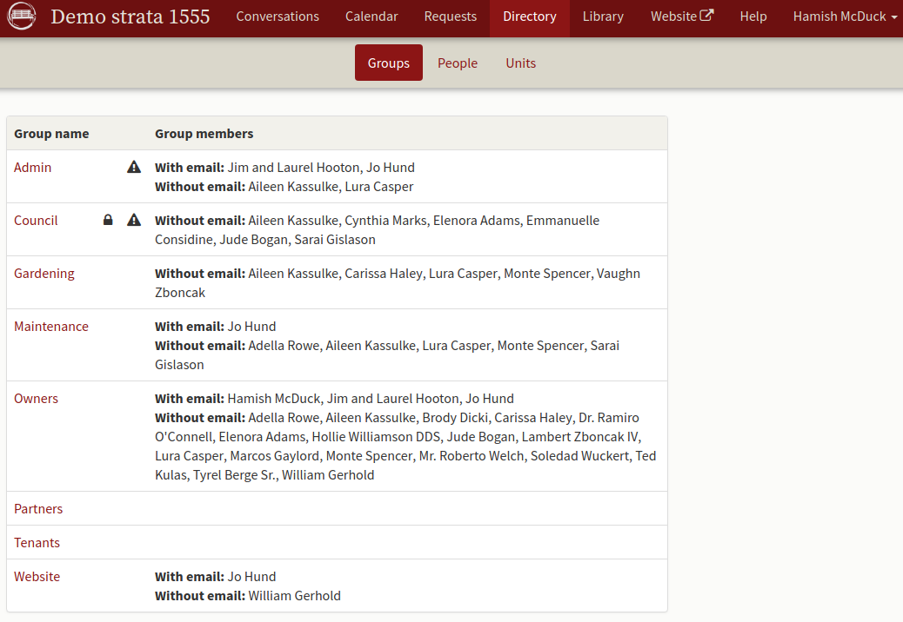

Clicking on the highlighted group name gives a brief summary concerning that group which includes:

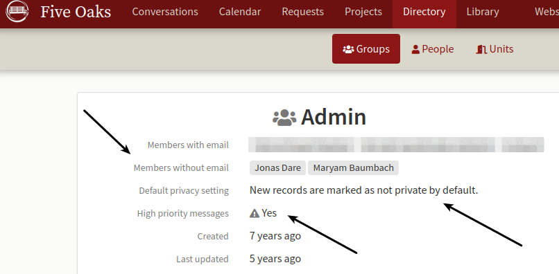

#### Members with email and Members without email.

This is a list of those in the group that will receive email.

#### Default privacy setting

Your system administrator may set a default privacy setting for each group. It may be private or not private.  If the  group is marked "private" only members of the group may see any item associated with the group.   An icon showing a closed pad lock on the main "group" screen indicates the group is private.

#### High priority messages

The system administrator may allow a group to send an email to all user's home email system by way of an announcement.

### Units

To the right of the **People** button is **Units** which allows you to see the directory organized in Unit order by unit name or number and the Owner or Tenant residing in that location.  

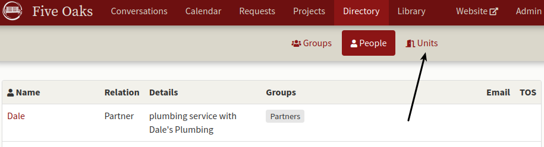

To the far right of the chart, you may see a paper clip icon.  This icon shows that there is a document attached to that unit.  By default, access to the attached document is limited to the Owner and the System Administrator.  (Please see our FAQ's for administrators on how to attach a document to a unit.)  In addition, you will see special fields your administrator may have created, in this case, the screen is showing Parking stall # assigned.  (Again, see our FAQ's for administrators.)

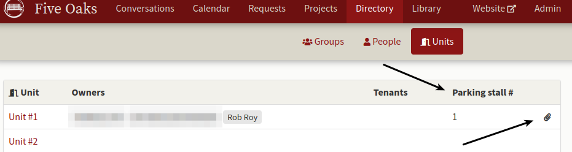

## The library service

The **Library** Service is found on the main menu bar across the top next to the Directory Service.  (This assumes your computer’s browser is mostly full screen.  If you’re using a tablet or your browser is partial screen, click on the three lines on the far right of the top bar to expand the main menu.)  

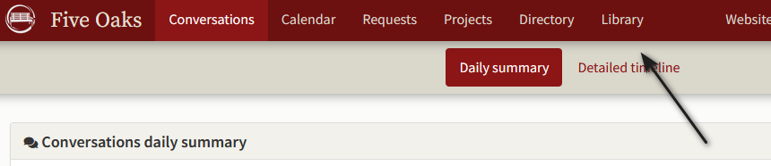

Clicking on this opens the **Documents** screen by default.  You will see another header called **Web links** beside **Documents** which when clicked will show the **Web Link** service.  Many Stratas find these two services invaluable as resource for Strata Owners, Renters or Partners providing access to agendas, contracts, financial statements, and a link to the on line version of the B.C. Strata Act among other things.

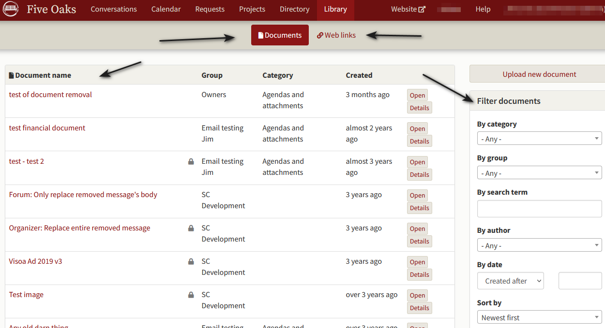

The default document screen has a large box on the left showing documents listed in date order with their name, group, category and date of creation.  There is a button to **Create new document** on the right at the top and below this is the **Filter documents** service which provides a detailed search functions to control what documents appear on the left.

The **Web links** screen has a similar layout.

### Reading a document

In the main screen showing the list of documents, there is a short cut to view the document on the right of the date column where you may click on the **Open** button and skip the details screen if you wish.  There is also a button called **Details** which will open the information screen.

n the default document screen, you will see document names highlighted in the left hand column.  Clicking on the document name will open a screen showing more detailed information related to the document including a full description of when it was uploaded, by whom, the group and category.  Any comments on the document made by other strata members are included at the bottom of the screen.  In addition there is a button called **Open file** which when clicked will open the file in the StrataCommons Organizer screen on your web browsers assuming it is a PDF file.

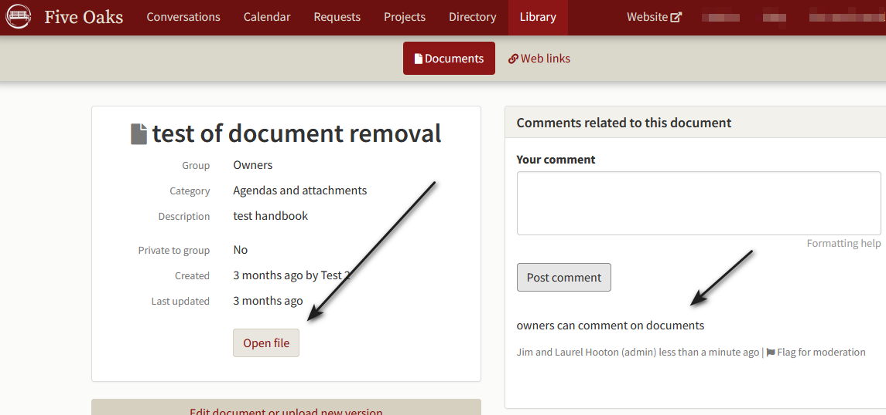

Recently, browsers have added settings that prevent a document from opening on screen and force you to download it.  Please see your browser documentation if this is the case.  

**Hint** StrataCommons Organizer will only accept PDF files.  Most word processors allow the creator to save their documents in this format and it makes online access for Owners, Renters and Partners much easier.  Many owners may not have the necessary software to read a file created by a new version of Microsoft Word for example.

The usual web based PDF functions are available allowing you to print or save the document.  Click on your browser's back button to take you back to the specific document screen in the StrataCommons Organizer Library and then clicking on **Library** takes you back to the default screen showing all documents.

### Adding a document

In the **Documents** screen there is a **Create new document** button on the right hand side at the top above the **Select document category** heading.  Clicking on this will open a screen to add a document.  The **New document** screen has a number of options for your use.

**Hint**  All information entered in the **Create New document** screen is searchable.  Taking the time to enter this information makes document retrieval much easier.

")

#### Group.

Clicking in the **Group** box will give you a list of all of the strata groups available and you may choose one or several by repeating this procedure.  You may choose one group or several but only the groups you belong to are available for you to choose from and only those in the group may see the document if you choose **visible to group members only.**  Choosing a group assists others in finding the documents.

#### Upload a file from your computer

Clicking on **Choose File** will open a file manager showing your computer filing system.  Navigate through your file manager to find the document you wish to upload.  Please use files in PDF format.

#### Category

Clicking on the **- Please choose -** button will open a list of available categories to help with file retrieval.  Please select one.

**Note** Your council should work with your system admin to sort out a number of additional categories to help strata members file their documents.  In our experience, categories like agendas and attachments, contracts, financial reports etc. are very useful.

#### Description

Click in the **Description** box and enter a one or two sentence detailed description of the document to help other users know if this is the document that will be of most assistance to them.

#### Override creation date (leave blank for current date)

Clicking on this box will open a calendar that you may use if you for some reason you want this document date of creation on StrataCommons Organizer to be different than today's date.  This is useful if the system admin person is entering historical documents that originate much earlier than the current date.  Although the date the document was created in the library may have been today (and therefore it is listed as the most "recent" document) the original date it was created might have been several years ago.  This can be especially important if somebody is searching by date.

At the bottom of these choices, there is a **Create document** button.  Click on this and StrataCommons Organizer will upload your document and create a message indicating success.  Once the document is created, a comment window is available if you want to create a message to inform other users there is a new addition to the Library.  Please note that this comment does not include the document as an attachment when it goes to users.  **You will receive an error message if you attempt to load a document that is not in PDF format.**

#### Cancel

There is a **Cancel** button on the top right side of the screen to stop the document creation process.

### Finding a document

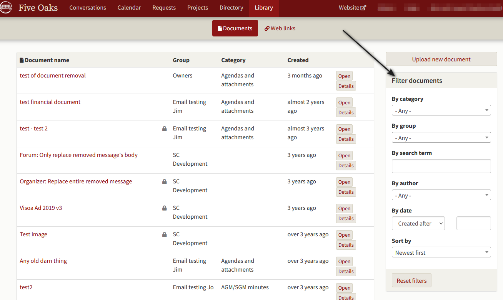

StrataCommons Organizer uses a similar search function in all its services called **Filter documents** which allows you to enter a search parameter in any of the following drop down boxes:

[Filter details](#Filters)

### Using web links

Clicking on the **Web links** button at the top of the screen on the left will open the web links service. You will see a list of the available web link names on the left with a Web Address beside them.   

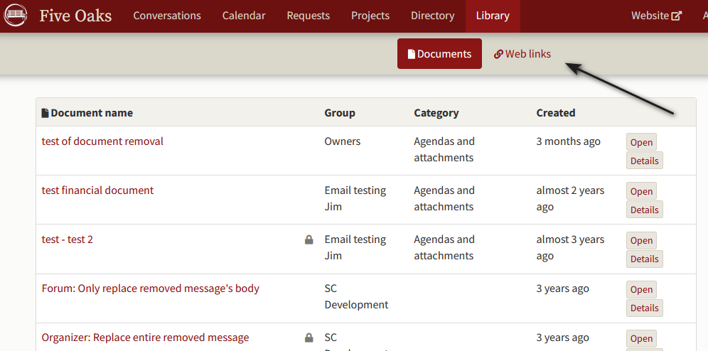

Clicking on the web address will take you directly from StrataCommons Organizer to that web site.  Clicking on the web link name will give you further details on the link to help you decide if the link is the best one for you to use.

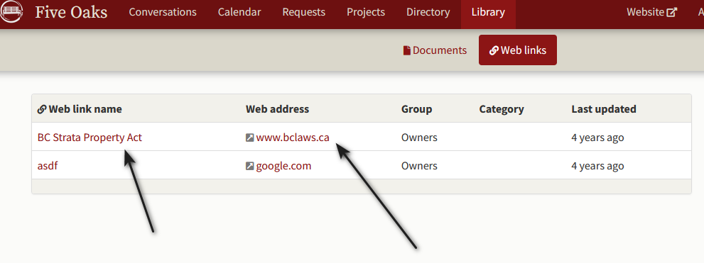

#### Adding web links

On the top of your application on the right hand side there is a **Create new web link** button that will open a screen allowing you to create a new web link.

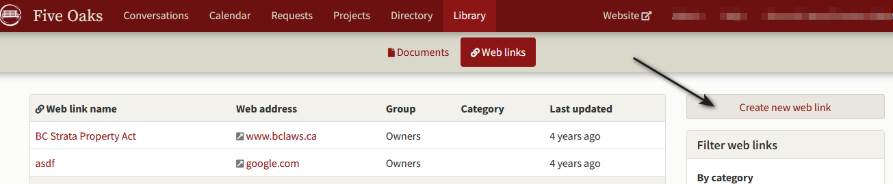

All information entered in the **Create a new web link** screen are searchable.  Taking the time to enter this information makes document retrieval much easier.  The following screen opens:

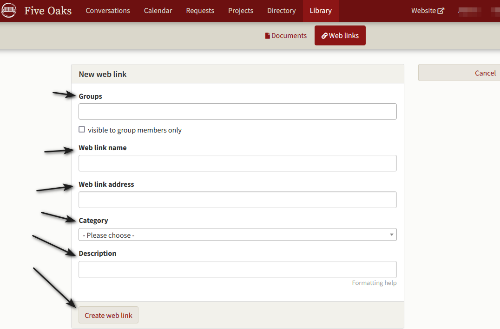

##### Group.

Clicking in the **Group** box will give you a list of all of the strata groups available and you may choose one or several by repeating this procedure.  You may choose one group or several but only the groups you belong to are available for you to choose from and only those in the group may see the document if you choose **visible to group members only.**  Choosing a group primarily assists others in finding the documents.

##### Web link name

Choose a descriptive name for the web link.  Click on the box and type in something that will help others understand what the link will do for them.

##### Web link address

Click on this box and type in the full web address for the site from your browser usually in the form of www.website.ca  or https://website.ca.

**Hint** Go to the website of your interest and copy the web address from your browser's address bar usually found at the top of the web browser.  Double clicking on the bar and then using Cntrl c (control key and the letter "c") will allow you to cut the address and then returning to the StrataCommons Organizer screen and click on the the Web link address box and use cntrl v (control key and the letter v) to paste the URL or web address.

##### Category

Clicking on the **- Please choose -** button will open a list of available categories to help with file retrieval.  Please select one.

**Hint** Your council should work with your system admin to sort out a number of additional categories to help strata members file their documents.  In our experience, categories like agendas and attachments, contracts, financial reports etc. are very useful.

##### Description

Click in the **Description** box and enter a one or two sentence detailed description of the document to help other users know if this is the document that will be of most assistance to them.

#### Finding a web link

StrataCommons Organizer uses a similar search function in all its services found by clicking on **Filter web links** (right hand side top under **Create new web link** which allows you to enter a search parameter in any of the following drop down boxes:

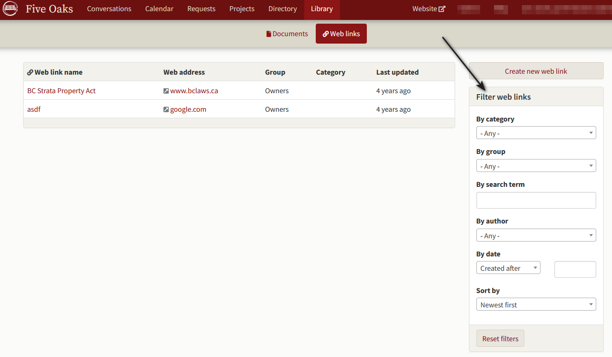

[Filter details](#Filters)

## The website service

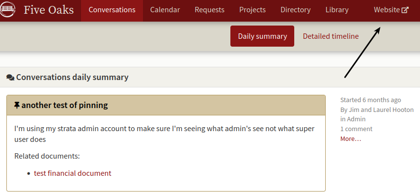

Every strata that subscribes is provided with a website available to the public if the Strata chooses to do so.  Your system administrator or those in the web group administrator may add photos which will be cycled through on the web site as well as relevant titles and text.  The website will be found at https://stratacommons.ca/*the-strata name*.  Clicking on the service in the main menu will take you directly to the website as it currently exists.  Members of the web group or system administrators may contact StrataCommons for details on how to set up their website.

## System administration services

Every service provides additional functions for System Administrators.  Anyone who is added to the "Admin" group has elevated powers that allow them to delete messages, change people from one group to another, allow groups to send email notices, make new records private to group, add new groups, rename or delete groups and a variety of other services.

It is important that your admin person not remove themselves from the admin group or your strata will lose its admin capabilities.  If that happens, contact StrataCommons Organizer and we can assign your admin person back into their group.

Given the Admin person is usually somebody who has a strong computer background and therefore we will leave it to them to explore all of the functions available or to contact us if they have questions.  There is also a FAQ section.